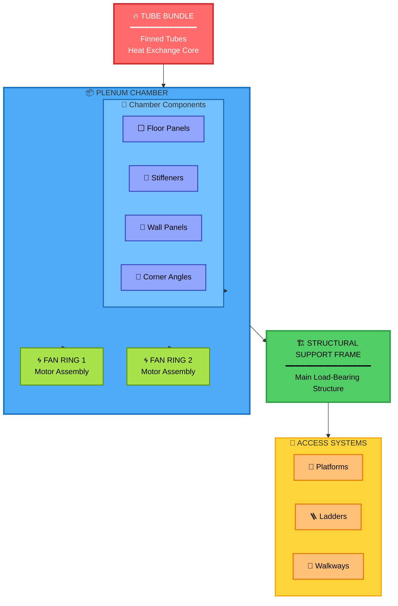

# Project Vulcan

[](https://github.com/DCornealius/Project_Vulcan_Fresh/actions/workflows/ci.yml)
[](https://coveralls.io/github/DCornealius/Project_Vulcan_Fresh?branch=main)
[](https://github.com/DCornealius/Project_Vulcan_Fresh/actions/workflows/ci.yml)
[](https://render.com)
[](https://modelcontextprotocol.org)

**Personal AI Operating System** - A unified web chatbot that physically controls your Windows PC for Trading, CAD, and Work workflows.

> **Vulcan is a personal AI Operating System that bridges cloud intelligence and desktop control to automate engineering and trading workflows.**


---

## What This Is

One chat interface that controls your entire digital life, powered by LLM-driven orchestration:

| Agent | Purpose | Status |
|-------|---------|--------|
| **Trading Bot** | Controls TradingView, analyzes charts, executes paper trades, generates PDF reports | ✅ Active |
| **CAD Agent AI** | Parses drawings, builds SolidWorks/Inventor models, validates with 130+ checks | ✅ Active |
| **Inspector Bot** | LLM-as-Judge auditing, grades outputs, generates improvement reports | ✅ Active |
| **System Manager** | Background daemon: scheduling, backups, health monitoring, metrics | ✅ Active |
| **Validation System** | Natural language validation commands (GD&T, welding, material, ACHE, HPC) | ✅ Complete |
| **Strategy Learning** | Autonomous learning loop that evolves CAD strategies based on performance | ✅ Complete |
| **HPC Standards** | HPC standards integration (lifting lugs, tie-downs, machinery mounts, walkways, headers) | ✅ **NEW** |

All agents share a **Desktop Control Server** (MCP) that physically operates your Windows PC + **Memory Brain** for persistent RAG knowledge.

### Phase 20 Complete: Autonomous Learning System

The bot now **learns and evolves** without user intervention:
- **Strategy Builder**: LLM-powered strategy creation from prompts
- **Performance Tracking**: Records success/failure of every validation
- **Pattern Analysis**: Weekly analysis identifies what works
- **Strategy Evolution**: LLM improves failing strategies automatically
- **Feedback Loop**: Runs weekly (Sunday 00:00 UTC)

---

## Architecture

```mermaid
flowchart TB
    Start([👤 User Access])
    
    subgraph Cloud["☁️ RENDER.COM - Cloud Infrastructure"]
        direction TB
        Web["🌐 Web Chatbot<br/>━━━━━━━━━━━━<br/>Next.js + React<br/>Port: 3000<br/>Accessible Anywhere"]
        
        Orch["🎯 Orchestrator<br/>━━━━━━━━━━━━<br/>FastAPI + Python<br/>Port: 8080<br/>Agent Coordination"]
        
        subgraph Agents["🤖 AI Agent Layer"]
            direction LR
            Trading["📈 Trading Agent<br/>TradingView Analysis<br/>Paper Trading"]
            CAD["📐 CAD Agent<br/>SolidWorks Control<br/>Drawing Validation"]
            Work["💼 Work Hub<br/>Browser Automation<br/>J2 Integration"]
            General["💬 General Agent<br/>Chat Assistant<br/>Knowledge Base"]
        end
        
        subgraph CloudServices["⚙️ Cloud Services"]
            direction LR
            Redis["🔴 Redis<br/>━━━━━━<br/>Cache Layer<br/>Rate Limiting"]
            Chroma["🧠 ChromaDB<br/>━━━━━━<br/>Vector Memory<br/>RAG System"]
            Postgres["🐘 PostgreSQL<br/>━━━━━━<br/>Database<br/>Prisma ORM"]
        end
    end
    
    VPN{"🔐 Tailscale VPN<br/>━━━━━━━━━━━━<br/>Secure Tunnel<br/>Encrypted Connection"}
    
    subgraph Local["💻 YOUR WINDOWS PC - Local Environment"]
        direction TB
        Desktop["🖥️ Desktop Control Server<br/>━━━━━━━━━━━━━━━━<br/>MCP Protocol Server<br/>FastAPI + Python<br/>Port: 8765"]
        
        subgraph Controllers["🎮 Control Layer"]
            direction LR
            Mouse["🖱️ Mouse<br/>PyAutoGUI"]
            Keyboard["⌨️ Keyboard<br/>Input Control"]
            Screen["📸 Screenshot<br/>MSS Library"]
            Browser["🌐 Browser<br/>Playwright"]
        end
        
        subgraph LocalServices["🧠 Local Services"]
            direction LR
            Vector["📚 Vector Memory<br/>Local ChromaDB"]
            Replay["🔄 Action Replay<br/>Verification"]
        end
        
        subgraph PhysicalApps["📦 Physical Applications"]
            direction LR
            TV["📊 TradingView<br/>Chart Analysis<br/>Paper Trading"]
            SW["🔧 SolidWorks<br/>3D CAD Modeling<br/>COM Automation"]
            J2["📋 J2 Tracker<br/>Work Management<br/>Browser Control"]
        end
    end
    
    Start --> Web
    Web --> Orch
    Orch --> Agents
    Orch <--> CloudServices
    
    Orch -.->|"HTTPS Request<br/>Secure API Call"| VPN
    VPN -.->|"Local Network<br/>100.x.x.x:8765"| Desktop
    
    Desktop --> Controllers
    Desktop --> LocalServices
    Controllers --> PhysicalApps
    
    style Start fill:#e1f5fe,stroke:#01579b,stroke-width:3px,color:#000
    style Cloud fill:#e3f2fd,stroke:#1976d2,stroke-width:4px
    style Local fill:#fff3e0,stroke:#f57c00,stroke-width:4px
    style VPN fill:#f3e5f5,stroke:#7b1fa2,stroke-width:3px,color:#000
    
    style Web fill:#4fc3f7,stroke:#0277bd,stroke-width:3px,color:#000
    style Orch fill:#81c784,stroke:#388e3c,stroke-width:3px,color:#000
    style Desktop fill:#ffb74d,stroke:#e65100,stroke-width:3px,color:#000
    
    style Agents fill:#e1bee7,stroke:#6a1b9a,stroke-width:2px
    style CloudServices fill:#90caf9,stroke:#1565c0,stroke-width:2px
    style Controllers fill:#ffcc80,stroke:#ef6c00,stroke-width:2px
    style LocalServices fill:#ce93d8,stroke:#6a1b9a,stroke-width:2px
    style PhysicalApps fill:#a5d6a7,stroke:#2e7d32,stroke-width:2px
    
    style Trading fill:#fff9c4,stroke:#f57f17,stroke-width:2px,color:#000
    style CAD fill:#b2dfdb,stroke:#00695c,stroke-width:2px,color:#000
    style Work fill:#d1c4e9,stroke:#4527a0,stroke-width:2px,color:#000
    style General fill:#f8bbd0,stroke:#c2185b,stroke-width:2px,color:#000
    
    style Redis fill:#ffccbc,stroke:#bf360c,stroke-width:2px,color:#000
    style Chroma fill:#c5cae9,stroke:#283593,stroke-width:2px,color:#000
    style Postgres fill:#b2ebf2,stroke:#006064,stroke-width:2px,color:#000
    
    style Mouse fill:#ffe0b2,stroke:#e65100,stroke-width:2px,color:#000
    style Keyboard fill:#ffe0b2,stroke:#e65100,stroke-width:2px,color:#000
    style Screen fill:#ffe0b2,stroke:#e65100,stroke-width:2px,color:#000
    style Browser fill:#ffe0b2,stroke:#e65100,stroke-width:2px,color:#000
    
    style Vector fill:#e1bee7,stroke:#6a1b9a,stroke-width:2px,color:#000
    style Replay fill:#e1bee7,stroke:#6a1b9a,stroke-width:2px,color:#000
    
    style TV fill:#c8e6c9,stroke:#2e7d32,stroke-width:2px,color:#000
    style SW fill:#c8e6c9,stroke:#2e7d32,stroke-width:2px,color:#000
    style J2 fill:#c8e6c9,stroke:#2e7d32,stroke-width:2px,color:#000
```



---

## Quick Start

### 1. Start Desktop Control Server (Local Windows PC)

```bash
cd desktop_server
pip install -r requirements.txt
python server.py
```

### 2. Start Web App (Development)

```bash
cd apps/web
npm install
npm run dev
```

### 3. Deploy to Render (Production)

```bash
git push origin main  # Auto-deploys via render.yaml
```

---

## Project Structure

```
Project_Vulcan/
├── apps/web/                  # Next.js Chat Interface & API Routes
│   ├── src/app/              # App Router pages (/, /trading, /cad, /work)
│   ├── src/components/       # React components
│   └── src/lib/              # Shared utilities (work, trading, cad clients)
│
├── desktop_server/           # MCP Server & Controllers
│   ├── server.py             # FastAPI server
│   ├── controllers/          # mouse, keyboard, screen, browser, j2_tracker
│   └── com/                  # SolidWorks/Inventor COM adapters
│
├── agents/                   # Specialized Agents
│   ├── trading_agent/        # Trading analysis & journaling
│   ├── cad_agent/            # CAD automation & drawing analysis
│   │   ├── adapters/         # standards_db, drawing_analyzer, weight_calculator
│   │   ├── strategy_builder.py   # LLM-powered strategy creation
│   │   ├── strategy_evolution.py # LLM-powered strategy improvement
│   │   ├── drawing_parser.py     # PDF/DWG extraction
│   │   └── cost_estimator.py     # Material cost calculation
│   ├── review_agent/         # Weekly review & strategy analysis
│   │   └── src/strategy_analyzer.py
│   ├── inspector_bot/        # LLM-as-Judge auditing
│   └── system-manager/       # Background daemon (scheduler, backup, health)
│
├── strategies/               # Strategy Management (Phase 20)
│   ├── product_models.py     # Digital Twin schemas
│   └── templates/            # Pre-built strategy templates (JSON)
│
├── core/                     # Shared Root Libraries
│   ├── llm.py               # Anthropic client with cost optimization
│   ├── memory.py            # RAG memory system
│   ├── feedback_loop.py     # Autonomous learning scheduler
│   ├── context_manager.py   # Cross-domain recall
│   ├── audit_logger.py      # System action tracking
│   ├── crypto_wrapper.py    # Secret encryption
│   ├── export_adapter.py    # Export strategies/plans
│   ├── workflows/engine.py  # Custom workflow automation
│   ├── metrics/             # Telemetry & scoring
│   │   ├── telemetry.py     # Token/cost tracking
│   │   └── strategy_scoring.py  # Performance scoring
│   ├── memory/              # Memory systems
│   │   └── knowledge_graph.py   # Long-term memory consolidation
│   └── system_manager/      # Backup & maintenance
│       └── backup_strategies.py
│
├── docs/                     # Documentation
│   ├── ache/                # ACHE Standards Checker docs
│   └── prds/                # Product Requirements Documents
│
├── storage/                  # Logs, Recordings, Judgments
├── config/                   # Configuration files
├── task.md                   # Master Task List
├── CLAUDE.md                 # AI instructions
├── RULES.md                  # Architecture rules
└── REFERENCES.md             # External dependencies
```

---

## Features

### Core & Connectivity

- **Unified Chat Interface** (Next.js) accessible from anywhere via **Tailscale**
- **Orchestrator** intelligent routing of user intent to specialized agents
- **MCP Server** exposing tools for Mouse, Keyboard, Screen, and Window control

### Trading Module

- **BTMM Analysis**: ICT/Smart Money trading methodology
- **Chart Analysis**: Pattern recognition and structure analysis
- **Trade Journal**: Structured logging of setups and results
- **Performance Review**: Weekly automated analysis

### CAD Module

- **Drawing Analysis**: OCR-based dimension and hole extraction
- **Weight Calculator**: Auto-calculation for plates, beams, angles
- **Hole Pattern Checker**: Mating part alignment verification
- **Red Flag Scanner**: Pre-scan for common drawing issues
- **BOM Cross-Checker**: Bill of Materials verification
- **Natural Language Validation**: "Check this drawing for GD&T errors"
- **Advanced Validators**: GD&T (28 checks), Welding (32 checks), Material (18 checks), ACHE (130 checks)
- **Offline Standards DB**: 658 standards (AISC, fasteners, pipes, materials)
- **PDF Annotation**: Visual error highlighting on drawings
- **PDM Integration**: SOLIDWORKS PDM Professional support

### Work Hub

- **Microsoft 365**: Outlook emails, Teams messages, SharePoint/OneDrive files
- **J2 Tracker**: Job tracking via browser automation (Playwright)
- **Device Code Flow**: No admin consent required for Microsoft auth

### System Manager

Background daemon for automated operations:

| Job | Schedule | Description |
|-----|----------|-------------|
| Daily Backup | 02:00 UTC | Backup storage to Google Drive |
| Health Check | Hourly | Check all service health |
| Metrics | Every 5 min | Collect system metrics |
| Weekly Report | Friday 17:00 | Generate performance report |

### ACHE Standards Checker

Air-Cooled Heat Exchanger drawing verification (in progress):

### ACHE Assembly Structure



**Key Standards:**
- API 661 - Air-Cooled Heat Exchangers
- OSHA 1910 - Platforms, ladders, handrails
- AMCA 204 - Fan balance grades
- AISC - Structural steel
- AWS D1.1 - Structural welding

### Cost Optimization

| Strategy | Savings |
|----------|---------|
| Redis Cache | 100% on cache hits |
| Model Router (Haiku) | 92% cheaper for simple tasks |
| Token Optimizer | 20-40% reduction |
| Anthropic Prompt Caching | 90% on system prompts |
| Batch API | 50% for non-urgent tasks |
| **Total Potential** | **90-95%** |

### Observability

- **Black Box Logging**: JSONL audit trails for every decision
- **Visual Replay**: On-demand screen recording
- **Visual Verification**: CAD "Visual Diffing" against reference images
- **LLM-as-a-Judge**: Automated auditor that critiques agent decisions

---

## Environment Variables

### Web App (.env.local)

```bash
# Anthropic
ANTHROPIC_API_KEY=sk-ant-...

# Microsoft Graph (Device Code Flow)
MICROSOFT_CLIENT_ID=your-app-id

# Desktop Server
DESKTOP_SERVER_URL=http://localhost:8000

# J2 Tracker
J2_TRACKER_URL=https://your-j2-tracker.com
```

### Desktop Server

```bash
# Token encryption
TOKEN_STORE_PATH=./data/tokens.enc
TOKEN_ENCRYPTION_KEY=your-32-byte-key
```

### System Manager

```bash
WEB_URL=https://your-vulcan.onrender.com
DESKTOP_SERVER_URL=http://localhost:8000
MEMORY_SERVER_URL=http://localhost:8001
GOOGLE_DRIVE_CREDENTIALS=./config/drive-credentials.json
```

---

## Documentation

| Document | Purpose |
|----------|---------|
| [CLAUDE.md](CLAUDE.md) | AI assistant behavioral instructions |
| [RULES.md](RULES.md) | Engineering rules and architecture |
| [REFERENCES.md](REFERENCES.md) | External dependencies |
| [task.md](task.md) | Master task list and roadmap |
| [docs/ache/](docs/ache/) | ACHE Standards Checker documentation |

---

## Strategy API Endpoints (Phase 20)

Endpoints secured via JWT (Authorization: Bearer `<token>`).

| Endpoint | Method | Description |
|----------|--------|-------------|
| `/api/strategies` | GET | List all strategies (with filters) |
| `/api/strategies` | POST | Create new strategy |
| `/api/strategies/{id}` | GET/PUT/DELETE | CRUD operations |
| `/api/strategies/{id}/performance` | GET/POST | Performance tracking |
| `/api/strategies/{id}/score` | GET | Calculate strategy score |
| `/api/strategies/rankings` | GET | Ranked leaderboard |
| `/api/strategies/{id}/evolve` | POST | Trigger LLM evolution |

**Scoring Formula**: `score = (accuracy × 0.6) + (speed × 0.2) + (quality × 0.2)`

---

## Success Criteria

| Metric | Target | Status |
|--------|--------|--------|
| Chat response | < 5 sec | ✅ Achieved |
| API cost reduction | > 50% | ✅ Achieved (90-95%) |
| Docker deployment | Working | ✅ Achieved |
| System Manager uptime | > 7 days | ✅ Achieved |
| CAD reconstruction | > 90% accuracy | ✅ Achieved |
| Trading module redesign | Complete | ✅ Achieved |
| Work Hub integration | Complete | ✅ Achieved |
| CAD Validation System | 130+ checks | ✅ Complete |
| Natural Language Validation | Working | ✅ Complete |
| Advanced Validators | GD&T, Welding, Material, ACHE | ✅ Complete |
| **Phase 20 Learning System** | Autonomous evolution | ✅ **Complete** |
| Production Ready | Yes | ✅ **Complete** |

---


---

## 🚀 Getting Started (The "Happy Path")

Follow this exact order to bring Vulcan online:

### 1. Prerequisites & Environment
- **OS**: Windows 10/11 Professional (Required for Hyper-V/Docker)
- **CAD**: SolidWorks 2023+ or Inventor 2024+
- **Runtime**: Python 3.11+, Node.js 20+ (LTS)
- **Database**: Redis & PostgreSQL (running via Docker)
- **Network**: Tailscale VPN (must be active for remote access)

### 2. Startup Sequence

#### Step A: Infrastructure (Docker)
```bash
docker-compose up -d redis postgres chroma
```

#### Step B: Desktop Control Server (Local PC)
```bash
# In a new terminal (Admin):
cd desktop_server
python -m venv venv
.\venv\Scripts\activate
pip install -r requirements.txt
python server.py
# ✅ Expected: "Serving on 0.0.0.0:8000"
```

#### Step C: Web Orchestrator
```bash
# In a new terminal:
cd apps/web
npm install
npm run dev
# ✅ Expected: "Ready on http://localhost:3000"
```

#### Step D: Verify Connectivity
Log in to `http://localhost:3000` and type `/health`.
- VPN: Connected 🟢
- Desktop: Online 🟢
- Memory: Ready 🟢

---

## 🧪 Testing & Validation

### Run Unit Tests
```bash
# PyTest (Backend Agents)
cd agents
pytest -v
# or specific agent
pytest cad_agent/tests/

# Jest (Frontend)
cd apps/web
npm run test
```

### CLI Fallback
```bash
python core/cli.py --task "build 6 inch flange"
```

*Note: CI/CD runs automatically on GitHub Actions push.*

---

## 🔒 Security & Privacy

- **Data Storage**: Client data lives in `storage/` and `data/` (local only).
- **Credentials**:
  - API Keys are encrypted at rest using `core/crypto_wrapper.py`.
  - Token store: `data/tokens.enc`.
  - **Recommendation**: Rotate `VULCAN_SECRET_KEY` monthly.
- **Audit Logs**: All sensitive actions logged to `storage/logs/audit.jsonl`.

---

## ⚠️ Known Issues

| Issue | Status | Workaround |
|-------|--------|------------|
| **PDF Parsing** | ⚠️ Beta | Complex tables sometimes misread |
| **SolidWorks COM** | ⚠️ Flaky | Restart SolidWorks if "RPC Error" occurs |

---

## 🗺️ Roadmap Summary

- **Phase 19-20 (Complete)**: Strategy Learning System, Cost Estimator, Backups.
- **Phase 21 (Complete)**: Enhanced CAD Validation, Testing, Voice, Analytics.
- **Phase 22**: Workflow Automation Engine.
- **Phase 23**: Mobile PWA & Voice Interface.
- **Phase 24**: Enterprise features (Skipped for personal use).

---

## 🛠️ Maintenance & Operations

- **Backups**: Strategies archived to `storage/backups/*.zip` daily.
- **Logs**:
  - System logs: `storage/logs/system.log`
  - Learning logs: `data/learning_logs/history.jsonl`
- **Updates**: Run `scripts/update_standards.py` monthly to pull new AISC/ASME data.

---

## License & Contact

**© 2025 D. Cornealius — Internal Use Only. Redistribution prohibited.**
Maintained by **DCornealius** — For questions, connect on LinkedIn.
- Contact via LinkedIn for inquiries.
- CI/CD Status: [GitHub Actions](https://github.com/DCornealius/Project_Vulcan_Fresh/actions)

---
**Built with Vulcan Team** 🖖
