# Project Vulcan

[](https://github.com/DCornealius/Project_Vulcan_Fresh/actions/workflows/ci.yml)
[](https://coveralls.io/github/DCornealius/Project_Vulcan_Fresh?branch=main)
[](https://github.com/DCornealius/Project_Vulcan_Fresh/actions/workflows/ci.yml)
[](https://render.com)
[](https://modelcontextprotocol.org)

**Personal AI Operating System** - A unified web chatbot that physically controls your Windows PC for Trading, CAD, and Work workflows.

---

## What This Is

One chat interface that controls your entire digital life, powered by LLM-driven orchestration:

| Agent | Purpose | Status |
|-------|---------|--------|
| **Trading Bot** | Controls TradingView, analyzes charts, executes paper trades, generates PDF reports | ✅ Active |
| **CAD Agent AI** | Parses drawings, builds SolidWorks/Inventor models, validates with 130+ checks | ✅ Active |
| **Inspector Bot** | LLM-as-Judge auditing, grades outputs, generates improvement reports | ✅ Active |
| **System Manager** | Background daemon: scheduling, backups, health monitoring, metrics | ✅ Active |
| **Validation System** | Natural language validation commands (GD&T, welding, material, ACHE) | ✅ Complete |

All agents share a **Desktop Control Server** (MCP) that physically operates your Windows PC + **Memory Brain** for persistent RAG knowledge.

---

## Architecture

```mermaid
flowchart TB
    Start([👤 User Access])
    
    subgraph Cloud["☁️ RENDER.COM - Cloud Infrastructure"]
        direction TB
        Web["🌐 Web Chatbot<br/>━━━━━━━━━━━━<br/>Next.js + React<br/>Port: 3000<br/>Accessible Anywhere"]
        
        Orch["🎯 Orchestrator<br/>━━━━━━━━━━━━<br/>FastAPI + Python<br/>Port: 8080<br/>Agent Coordination"]
        
        subgraph Agents["🤖 AI Agent Layer"]
            direction LR
            Trading["📈 Trading Agent<br/>TradingView Analysis<br/>Paper Trading"]
            CAD["📐 CAD Agent<br/>SolidWorks Control<br/>Drawing Validation"]
            Work["💼 Work Hub<br/>Browser Automation<br/>J2 Integration"]
            General["💬 General Agent<br/>Chat Assistant<br/>Knowledge Base"]
        end
        
        subgraph CloudServices["⚙️ Cloud Services"]
            direction LR
            Redis["🔴 Redis<br/>━━━━━━<br/>Cache Layer<br/>Rate Limiting"]
            Chroma["🧠 ChromaDB<br/>━━━━━━<br/>Vector Memory<br/>RAG System"]
            Postgres["🐘 PostgreSQL<br/>━━━━━━<br/>Database<br/>Prisma ORM"]
        end
    end
    
    VPN{"🔐 Tailscale VPN<br/>━━━━━━━━━━━━<br/>Secure Tunnel<br/>Encrypted Connection"}
    
    subgraph Local["💻 YOUR WINDOWS PC - Local Environment"]
        direction TB
        Desktop["🖥️ Desktop Control Server<br/>━━━━━━━━━━━━━━━━<br/>MCP Protocol Server<br/>FastAPI + Python<br/>Port: 8765"]
        
        subgraph Controllers["🎮 Control Layer"]
            direction LR
            Mouse["🖱️ Mouse<br/>PyAutoGUI"]
            Keyboard["⌨️ Keyboard<br/>Input Control"]
            Screen["📸 Screenshot<br/>MSS Library"]
            Browser["🌐 Browser<br/>Playwright"]
        end
        
        subgraph LocalServices["🧠 Local Services"]
            direction LR
            Vector["📚 Vector Memory<br/>Local ChromaDB"]
            Replay["🔄 Action Replay<br/>Verification"]
        end
        
        subgraph PhysicalApps["📦 Physical Applications"]
            direction LR
            TV["📊 TradingView<br/>Chart Analysis<br/>Paper Trading"]
            SW["🔧 SolidWorks<br/>3D CAD Modeling<br/>COM Automation"]
            J2["📋 J2 Tracker<br/>Work Management<br/>Browser Control"]
        end
    end
    
    Start --> Web
    Web --> Orch
    Orch --> Agents
    Orch <--> CloudServices
    
    Orch -.->|"HTTPS Request<br/>Secure API Call"| VPN
    VPN -.->|"Local Network<br/>100.x.x.x:8765"| Desktop
    
    Desktop --> Controllers
    Desktop --> LocalServices
    Controllers --> PhysicalApps
    
    style Start fill:#e1f5fe,stroke:#01579b,stroke-width:3px,color:#000
    style Cloud fill:#e3f2fd,stroke:#1976d2,stroke-width:4px
    style Local fill:#fff3e0,stroke:#f57c00,stroke-width:4px
    style VPN fill:#f3e5f5,stroke:#7b1fa2,stroke-width:3px,color:#000
    
    style Web fill:#4fc3f7,stroke:#0277bd,stroke-width:3px,color:#000
    style Orch fill:#81c784,stroke:#388e3c,stroke-width:3px,color:#000
    style Desktop fill:#ffb74d,stroke:#e65100,stroke-width:3px,color:#000
    
    style Agents fill:#e1bee7,stroke:#6a1b9a,stroke-width:2px
    style CloudServices fill:#90caf9,stroke:#1565c0,stroke-width:2px
    style Controllers fill:#ffcc80,stroke:#ef6c00,stroke-width:2px
    style LocalServices fill:#ce93d8,stroke:#6a1b9a,stroke-width:2px
    style PhysicalApps fill:#a5d6a7,stroke:#2e7d32,stroke-width:2px
    
    style Trading fill:#fff9c4,stroke:#f57f17,stroke-width:2px,color:#000
    style CAD fill:#b2dfdb,stroke:#00695c,stroke-width:2px,color:#000
    style Work fill:#d1c4e9,stroke:#4527a0,stroke-width:2px,color:#000
    style General fill:#f8bbd0,stroke:#c2185b,stroke-width:2px,color:#000
    
    style Redis fill:#ffccbc,stroke:#bf360c,stroke-width:2px,color:#000
    style Chroma fill:#c5cae9,stroke:#283593,stroke-width:2px,color:#000
    style Postgres fill:#b2ebf2,stroke:#006064,stroke-width:2px,color:#000
    
    style Mouse fill:#ffe0b2,stroke:#e65100,stroke-width:2px,color:#000
    style Keyboard fill:#ffe0b2,stroke:#e65100,stroke-width:2px,color:#000
    style Screen fill:#ffe0b2,stroke:#e65100,stroke-width:2px,color:#000
    style Browser fill:#ffe0b2,stroke:#e65100,stroke-width:2px,color:#000
    
    style Vector fill:#e1bee7,stroke:#6a1b9a,stroke-width:2px,color:#000
    style Replay fill:#e1bee7,stroke:#6a1b9a,stroke-width:2px,color:#000
    
    style TV fill:#c8e6c9,stroke:#2e7d32,stroke-width:2px,color:#000
    style SW fill:#c8e6c9,stroke:#2e7d32,stroke-width:2px,color:#000
    style J2 fill:#c8e6c9,stroke:#2e7d32,stroke-width:2px,color:#000
```



---

## Quick Start

### 1. Start Desktop Control Server (Local Windows PC)

```bash
cd desktop_server
pip install -r requirements.txt
python server.py
```

### 2. Start Web App (Development)

```bash
cd apps/web
npm install
npm run dev
```

### 3. Deploy to Render (Production)

```bash
git push origin main  # Auto-deploys via render.yaml
```

---

## Project Structure

```
Project_Vulcan/
├── apps/web/                  # Next.js Chat Interface & API Routes
│   ├── src/app/              # App Router pages (/, /trading, /cad, /work)
│   ├── src/components/       # React components
│   └── src/lib/              # Shared utilities (work, trading, cad clients)
│
├── desktop_server/           # MCP Server & Controllers
│   ├── server.py             # FastAPI server
│   ├── controllers/          # mouse, keyboard, screen, browser, j2_tracker
│   └── com/                  # SolidWorks/Inventor COM adapters
│
├── agents/                   # Specialized Agents
│   ├── trading_agent/        # Trading analysis & journaling
│   ├── cad_agent/            # CAD automation & drawing analysis
│   │   └── adapters/         # standards_db, drawing_analyzer, weight_calculator
│   ├── inspector_bot/        # LLM-as-Judge auditing
│   └── system-manager/       # Background daemon (scheduler, backup, health)
│
├── core/                     # Shared Root Libraries
│   ├── llm.py               # Anthropic client with cost optimization
│   └── memory.py            # RAG memory system
│
├── docs/                     # Documentation
│   ├── ache/                # ACHE Standards Checker docs
│   └── prds/                # Product Requirements Documents
│
├── storage/                  # Logs, Recordings, Judgments
├── config/                   # Configuration files
├── task.md                   # Master Task List
├── CLAUDE.md                 # AI instructions
├── RULES.md                  # Architecture rules
└── REFERENCES.md             # External dependencies
```

---

## Features

### Core & Connectivity

- **Unified Chat Interface** (Next.js) accessible from anywhere via **Tailscale**
- **Orchestrator** intelligent routing of user intent to specialized agents
- **MCP Server** exposing tools for Mouse, Keyboard, Screen, and Window control

### Trading Module

- **BTMM Analysis**: ICT/Smart Money trading methodology
- **Chart Analysis**: Pattern recognition and structure analysis
- **Trade Journal**: Structured logging of setups and results
- **Performance Review**: Weekly automated analysis

### CAD Module

- **Drawing Analysis**: OCR-based dimension and hole extraction
- **Weight Calculator**: Auto-calculation for plates, beams, angles
- **Hole Pattern Checker**: Mating part alignment verification
- **Red Flag Scanner**: Pre-scan for common drawing issues
- **BOM Cross-Checker**: Bill of Materials verification
- **Natural Language Validation**: "Check this drawing for GD&T errors"
- **Advanced Validators**: GD&T (28 checks), Welding (32 checks), Material (18 checks), ACHE (130 checks)
- **Offline Standards DB**: 658 standards (AISC, fasteners, pipes, materials)
- **PDF Annotation**: Visual error highlighting on drawings
- **Flatter Files Integration**: Drawing search and download
- **PDM Integration**: SOLIDWORKS PDM Professional support

### Work Hub

- **Microsoft 365**: Outlook emails, Teams messages, SharePoint/OneDrive files
- **J2 Tracker**: Job tracking via browser automation (Playwright)
- **Device Code Flow**: No admin consent required for Microsoft auth

### System Manager

Background daemon for automated operations:

| Job | Schedule | Description |
|-----|----------|-------------|
| Daily Backup | 02:00 UTC | Backup storage to Google Drive |
| Health Check | Hourly | Check all service health |
| Metrics | Every 5 min | Collect system metrics |
| Weekly Report | Friday 17:00 | Generate performance report |

### ACHE Standards Checker

Air-Cooled Heat Exchanger drawing verification (in progress):

```
                    TUBE BUNDLE (Finned Tubes)
                           |
+----------------------------------------------------------+
|                    PLENUM CHAMBER                         |
|              +----------+    +----------+                 |
|              | FAN RING |    | FAN RING |                 |
|              +----------+    +----------+                 |
|     Floor panels, stiffeners, wall panels, corner angles  |
+----------------------------------------------------------+
                           |
              STRUCTURAL SUPPORT FRAME
                           |
              PLATFORMS, LADDERS, WALKWAYS
```

**Key Standards:**
- API 661 - Air-Cooled Heat Exchangers
- OSHA 1910 - Platforms, ladders, handrails
- AMCA 204 - Fan balance grades
- AISC - Structural steel
- AWS D1.1 - Structural welding

### Cost Optimization

| Strategy | Savings |
|----------|---------|
| Redis Cache | 100% on cache hits |
| Model Router (Haiku) | 92% cheaper for simple tasks |
| Token Optimizer | 20-40% reduction |
| Anthropic Prompt Caching | 90% on system prompts |
| Batch API | 50% for non-urgent tasks |
| **Total Potential** | **90-95%** |

### Observability

- **Black Box Logging**: JSONL audit trails for every decision
- **Visual Replay**: On-demand screen recording
- **Visual Verification**: CAD "Visual Diffing" against reference images
- **LLM-as-a-Judge**: Automated auditor that critiques agent decisions

---

## Environment Variables

### Web App (.env.local)

```bash
# Anthropic
ANTHROPIC_API_KEY=sk-ant-...

# Microsoft Graph (Device Code Flow)
MICROSOFT_CLIENT_ID=your-app-id

# Desktop Server
DESKTOP_SERVER_URL=http://localhost:8000

# J2 Tracker
J2_TRACKER_URL=https://your-j2-tracker.com
```

### Desktop Server

```bash
# Token encryption
TOKEN_STORE_PATH=./data/tokens.enc
TOKEN_ENCRYPTION_KEY=your-32-byte-key
```

### System Manager

```bash
WEB_URL=https://your-vulcan.onrender.com
DESKTOP_SERVER_URL=http://localhost:8000
MEMORY_SERVER_URL=http://localhost:8001
GOOGLE_DRIVE_CREDENTIALS=./config/drive-credentials.json
```

---

## Documentation

| Document | Purpose |
|----------|---------|
| [CLAUDE.md](CLAUDE.md) | AI assistant behavioral instructions |
| [RULES.md](RULES.md) | Engineering rules and architecture |
| [REFERENCES.md](REFERENCES.md) | External dependencies |
| [task.md](task.md) | Master task list and roadmap |
| [docs/ache/](docs/ache/) | ACHE Standards Checker documentation |

---

## Success Criteria

| Metric | Target | Status |
|--------|--------|--------|
| Chat response | < 5 sec | ✅ Achieved |
| API cost reduction | > 50% | ✅ Achieved (90-95%) |
| Docker deployment | Working | ✅ Achieved |
| System Manager uptime | > 7 days | ✅ Achieved |
| CAD reconstruction | > 90% accuracy | ✅ Achieved |
| Trading module redesign | Complete | ✅ Achieved |
| Work Hub integration | Complete | ✅ Achieved |
| CAD Validation System | 130+ checks | ✅ Complete |
| Natural Language Validation | Working | ✅ Complete |
| Advanced Validators | GD&T, Welding, Material, ACHE | ✅ Complete |
| Production Ready | Yes | ⚠️ 2-3 weeks (Phase 19) |

---

## License

Private project. All rights reserved.

---

**Built with Vulcan Team**
