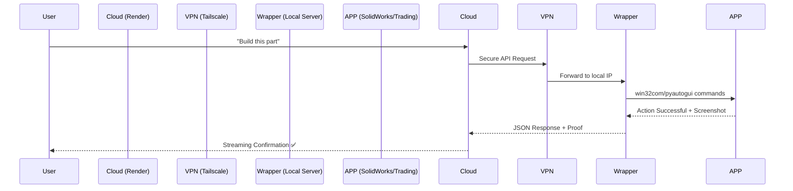

# Rules for Personal AI Operating System

Give this document to Claude, Cursor, or any AI assistant when working on this project.

---

## SECTION 1: PROJECT OVERVIEW

## What This Is

One web app chatbot that physically controls your entire digital life:

- **Trading Agent** — Controls TradingView, analyzes charts, generates trading plans
- **CAD Agent** — Controls SolidWorks, AutoCAD, Inventor, Bentley

All agents share a **Desktop Control Server** that physically operates your Windows PC (mouse, keyboard, screenshots, window control).

## Architecture

```text
┌─────────────────────────────────────────────────────────────────────────────┐
│                         YOUR WEB CHATBOT                                    │
│                        (One Chat Interface)                                 │
└─────────────────────────────────────┬───────────────────────────────────────┘
                                      │
                                      ▼
┌─────────────────────────────────────────────────────────────────────────────┐
│                           ORCHESTRATOR                                      │
│                   (Routes requests to correct agent)                        │
└─────────────────────────────────────┬───────────────────────────────────────┘
                                      │
            ┌─────────────────────────┼─────────────────────────┐
            ▼                         ▼                         ▼
     ┌─────────────┐          ┌─────────────┐
     │   TRADING   │          │     CAD     │
     │    AGENT    │          │    AGENT    │
     └──────┬──────┘          └──────┬──────┘
            │                        │
            └────────────────────────┼────────────────────────┘
                                     ▼
┌─────────────────────────────────────────────────────────────────────────────┐
│                    DESKTOP CONTROL SERVER                                   │
│              (Runs on your Windows PC - Physical Control)                   │
│                                                                             │
│   🖱️ Mouse    ⌨️ Keyboard    📸 Screenshot    🔍 Zoom    📁 Files           │
└─────────────────────────────────────┬───────────────────────────────────────┘
                                      │
            ┌─────────────────────────┼─────────────────────────┐
            ▼                         ▼                         ▼
     ┌─────────────┐          ┌─────────────┐
     │ TradingView │          │ SolidWorks  │
     │  (Desktop)  │          │  AutoCAD    │
     │             │          │  Bentley    │
     └─────────────┘          └─────────────┘
```

---

## SECTION 2: REMOTE REPOSITORY REFERENCES (The Key Concept)

## The Problem With Cloning

```markdown
❌ TRADITIONAL APPROACH (BAD):

You: "I need SolidWorks automation"
AI: "Let me clone this repo..."

Result:
my-project/
├── src/                         ← Your 10 files
├── vendor/
│   └── solidworks-api/          ← 500 files you don’t need
│       ├── src/
│       ├── tests/
│       ├── docs/
│       ├── examples/
│       └── ...
└── Total: 510 files

Problems:
- AI loses context (too many files)
- Your project is bloated
- Maintenance nightmare
- You only needed 2 functions from that repo
```

## The Solution: Remote References

```markdown
✅ REMOTE REFERENCE APPROACH (GOOD):

You: "I need SolidWorks automation"
AI: "Let me search for packages and reference what we need..."

Result:
my-project/
├── src/
│   └── adapters/
│       └── solidworks_adapter.py   ← 50 lines YOU write
├── REFERENCES.md                   ← Documents what we use
└── requirements.txt                ← pip install pywin32

Total: 12 files

Benefits:
- AI has full context
- Your project stays small
- Easy to maintain
- You only include what you actually use
```

---

## THREE METHODS TO REFERENCE EXTERNAL CODE

### Method 1: Package Installation (BEST - Use When Possible)

Packages install into `venv/` or `node_modules/` which are EXCLUDED from your project via `.gitignore`.

```bash
# Python
pip install pyautogui          # Desktop control
pip install pillow             # Screenshots
pip install pywin32            # Windows COM (for SolidWorks, AutoCAD)
pip install pytesseract        # OCR

# Node
npm install @anthropic-ai/sdk  # Claude API
npm install puppeteer          # Browser control
```

Your `.gitignore`:

```text
venv/
node_modules/
__pycache__/
*.pyc
```

**Result:** You USE the code, but it's NOT in your project folder.

---

### Method 2: GitHub API Fetching (For Specific Files)

When you need to READ a specific file from a repo without cloning:

```python
"""
github_fetcher.py - Include this ONE file in your project
Lets you fetch any file from any GitHub repo without cloning
"""

import requests
from functools import lru_cache

class GitHubFetcher:
    BASE_URL = "https://api.github.com"

    def __init__(self, token: str = None):
        self.headers = {"Accept": "application/vnd.github.v3.raw"}
        if token:
            self.headers["Authorization"] = f"token {token}"

    def search_repos(self, query: str, limit: int = 10) -> list:
        """Search GitHub for repositories."""
        url = f"{self.BASE_URL}/search/repositories?q={query}&per_page={limit}"
        response = requests.get(url, headers=self.headers)
        if response.status_code == 200:
            return [{
                "name": r["full_name"],
                "url": r["html_url"],
                "description": r["description"],
                "stars": r["stargazers_count"]
            } for r in response.json().get("items", [])]
        return []

    @lru_cache(maxsize=100)
    def fetch_file(self, owner: str, repo: str, path: str, branch: str = "main") -> str:
        """Fetch a single file from GitHub WITHOUT cloning the repo."""
        url = f"{self.BASE_URL}/repos/{owner}/{repo}/contents/{path}?ref={branch}"
        response = requests.get(url, headers=self.headers)
        if response.status_code == 200:
            return response.text
        return None

    def list_directory(self, owner: str, repo: str, path: str = "") -> list:
        """List files in a repo directory without cloning."""
        url = f"{self.BASE_URL}/repos/{owner}/{repo}/contents/{path}"
        response = requests.get(url, headers=self.headers)
        if response.status_code == 200:
            return [{"name": f["name"], "path": f["path"], "type": f["type"]} 
                    for f in response.json()]
        return []
```

---

### Method 3: Thin Adapters (YOUR Code That Calls External Things)

Instead of copying external code, write YOUR OWN small adapter that CALLS external services:

```python
"""
adapters/solidworks_adapter.py

This is YOUR code - 50 lines that wraps SolidWorks COM API.
The actual COM library is installed via 'pip install pywin32'.
"""

import win32com.client

class SolidWorksAdapter:
    """Thin adapter to control SolidWorks via COM."""

    def __init__(self):
        self.app = None
        self.model = None

    def connect(self) -> bool:
        """Connect to running SolidWorks instance."""
        try:
            self.app = win32com.client.Dispatch("SldWorks.Application")
            self.app.Visible = True
            return True
        except Exception as e:
            print(f"Could not connect to SolidWorks: {e}")
            return False

    def new_part(self) -> bool:
        """Create a new part document."""
        if not self.app:
            return False
        self.model = self.app.NewDocument(
            "C:\\ProgramData\\SolidWorks\\templates\\Part.prtdot",
            0, 0, 0
        )
        return self.model is not None

    def create_sketch(self, plane: str = "Front"):
        """Start a new sketch on specified plane."""
        self.model.Extension.SelectByID2(f"{plane} Plane", "PLANE", 0, 0, 0, False, 0, None, 0)
        self.model.SketchManager.InsertSketch(True)

    def draw_circle(self, x: float, y: float, radius: float):
        """Draw a circle in the active sketch."""
        self.model.SketchManager.CreateCircle(x, y, 0, x + radius, y, 0)

    def extrude(self, depth: float):
        """Extrude the current sketch."""
        self.model.FeatureManager.FeatureExtrusion2(
            True, False, False, 0, 0, depth, 0, False, False, False, False,
            0, 0, False, False, False, False, True, True, True, 0, 0, False
        )

    def save(self, filepath: str):
        """Save the current document."""
        self.model.SaveAs(filepath)
```

---

## THE REFERENCES.md FILE

Document ALL external dependencies in one place:

```markdown
# REFERENCES.md
# External Dependencies Documentation

## Installed Packages (via pip - NOT in project folder)

| Package | Version | Purpose | Install Command |
|---------|---------|---------|-----------------|
| pyautogui | 0.9.54 | Mouse/keyboard automation | `pip install pyautogui` |
| pywin32 | 306 | Windows COM for CAD control | `pip install pywin32` |
| pillow | 10.0.0 | Screenshot processing | `pip install pillow` |
| pytesseract | 0.3.10 | OCR text recognition | `pip install pytesseract` |
| flask | 3.0.0 | Desktop server API | `pip install flask` |
| mss | 9.0.1 | Fast screenshots | `pip install mss` |

## GitHub Repos (REFERENCE ONLY - Not Cloned)

| Repo | Stars | Purpose | Key Files We Reference |
|------|-------|---------|------------------------|
| [akuleshov7/solidworks-api](https://github.com/...) | 234 | SW automation examples | `examples/create_part.py` |
| [pyautocad](https://github.com/...) | 456 | AutoCAD Python API | `README.md` for API docs |
```

---

## SECTION 3: BUILD RULES

## Rule 1: No Cloning

- ❌ **NEVER** clone external repositories into this project.
- ❌ **NEVER** copy large codebases into vendor folders.
- ✅ **DO** install packages via `pip`/`npm`.
- ✅ **DO** fetch specific files via GitHub API when needed.
- ✅ **DO** create **Thin Adapters** (YOUR 50-line wrappers).

## Rule 2: Search Before Building

Always check if a professional package already exists before writing custom automation logic.

- **Total Project**: Maximum 50 core files.
- **Adapters**: 50-100 lines.
- **Agents**: 100-300 lines.
- **If ANY file exceeds 300 lines → split it immediately.**

## Rule 14: Configuration Over Code

- **Move Logic to Files**: All changeable strategies (CAD rules, Trading plans) live in JSON/YAML or Markdown.
- **No Hard-Coding**: Python/Node code should only *read* these files.

## Rule 15: Single Responsibility & Lazy Loading

- **One Job Per File**: Split adapters, trackers, and writers into distinct files.
- **On-Demand Imports**: Use inner-function imports for heavy COM or GUI modules to keep memory low and startup fast.

## Rule 16: Externalize Heavy Data (gitignored)

- **Repo stays small**: Never store screenshots, logs, or CAD files in Git.
- **Local/Cloud Storage**: Use `C:\Vulcan\Outputs\` (local) or OneDrive for persistent data.

## Rule 17: AI Context Files (The .ai/ Folder)

- **Context First**: Always maintain a `.ai/CONTEXT.md` at the project root.
- **AI-Friendly Docs**: assistants read this first to understand the stack, avoiding bloated suggestions.

## Rule 4: Physical Control Architecture

All physical desktop control **must** go through the Desktop Control Server. Agents NEVER directly control the desktop.

## 2. User Stories

- **As a designer**: "Build a 6-inch ANSI flange with 8 bolts per strategy.json" → Bot automates SolidWorks, saves file, logs with screenshots.
- **As a trader**: "Scan GBP/USD for Q2 setup" → Bot checks alignments, executes paper trade, records lesson.
- **As a user**: Access 24/7 from phone, review journals without local PC on.

## Rule 6: Separate Knowledge Bases

Agent logic (`src/`) and domain knowledge (`knowledge/`) are separate.

## Rule 7: Clean Markdown Formatting

- Headings and lists must be surrounded by blank lines.
- Use 2 spaces for nested lists.
- Unified H1 per document.

## Rule 8: Fail-Safe & Human-in-the-Loop (HITL)

- 🔴 **CRITICAL**: All high-stake physical actions require explicit user approval (Trading execution, CAD file deletion, etc.).
- 🛑 **KILL SWITCH**: "Mouse-to-Corner" (top-left 10px) is a hard-coded priority to stop all automation immediately.

## Rule 9: Task-First Workflow (PRD-Led)

- Before any major feature, draft a **PRD** (Product Requirements Document) in `docs/prds/`.
- Breakdown the PRD into atomic tasks in `task.md` *before* writing any code.
- "Init -> Parse PRD -> Task Breakdown -> Execute" is the standard loop.

## Rule 10: The Supervisor Orchestration Pattern

- The **Orchestrator** acts as the central conductor.
- Agents (Trading, CAD) never communicate with each other directly; they always route through the Orchestrator.
- The Orchestrator handles delegation, progress monitoring, and final result synthesis.

## Rule 11: Producer-Reviewer Verification Loops

- Complex outputs (e.g., a Trading Plan or a CAD drawing) must undergo a verification loop.
- One agent (the "Producer") generates the draft, and a second agent (the "Reviewer") validates it against the current knowledge base before finalizing.

- **Agent Core**: All domain models, parsing, validation, and transformations live in the agent's `src/` or a shared `core/` package.
- **Thin Presentation**: APIs (FastAPI) and UIs (Next.js) are strictly presentation layers. They call the core but contain **ZERO** business logic.

## Rule 13: Single Source of Truth (SSOT) & No Duplication

- 🚫 **NO DUPLICATION**: Never create redundant files for the same purpose (e.g., multiple task lists or redundant PRDs).
- 🔄 **ALWAYS UPDATE**: Modify existing authoritative documents rather than creating "v2" or "lite" versions unless explicitly asked for archiving.
- 📂 **CENTRALIZED TASKS**: Use `c:\Users\DCornealius\Documents\GitHub\Project_Vulcan\task.md` as the ONLY authoritative track for progress.

---

## Rule 18: UX Elite - Streaming & Rich Feedback

- **Streaming Responses**: All agent responses must stream word-by-word (ChatGPT-style) to provide instant engagement.
- **Emoji-Status Markers**: Use consistent emojis for flow (✅ Success, 📊 Analyzing, 📈 Trade Placed, 🛑 Error).
- **Rich Formatting**: Mandatory use of bold, tables, and code blocks for scanability.

## Rule 19: Visual Proof & Inline Media

- **Auto-Screenshots**: Every physical desktop action (CAD construction, Trade entry) MUST be accompanied by an inline screenshot attachment.
- **Command Suggestions**: The UI should proactively suggest context-aware buttons (e.g., "Build Flange" after a CAD design is finalized).

## Rule 20: Voice-First Desk Control

- **Voice Input**: Prefer hands-free voice commands via Web Speech API for desk-side operations to maintain workflow focus.

## Rule 21: Standardized Tools (MCP)

- **Standard Protocol**: All new tools should be exposed via the **Model Context Protocol (MCP)** where possible.
- **Desktop Server Evolution**: The current FastAPI wrapper will evolve into an **MCP Server** over time, utilizing SSE (Server-Sent Events) for streaming capability.
- **Universal Compatibility**: This standard ensures that Claude, Cursor, and our custom agents can all control the desktop using the same interface.

---

## SECTION 4: PROJECT STRUCTURE

```text
Project_Vulcan/
├── .ai/                       # AI Assistant Context (.ai/CONTEXT.md)
├── docs/                      # PRDs, ADRs, Strategy MDs
├── apps/
│   └── web/                   # Next.js chatbot interface
├── agents/
│   ├── core/                  # Shared business logic
│   ├── trading-agent/         # Trading analysis & execution
│   ├── cad-agent/             # SolidWorks & AutoCAD integration
├── desktop-server/            # Python - Physical control API
│   ├── venv/                  # Pinned dependencies (ignored)
│   ├── controllers/           # Mouse, Keyboard, Screen
│   └── com/                   # CAD COM adapters (Lazy loaded)
├── storage/                   # gitignored local outputs
├── REFERENCES.md              # External documentation links
├── RULES.md                   # THIS FILE (Build rules)
├── task.md                    # Master Task List (SSOT)
└── README.md                  # Project overview
```

---

## SECTION 5: FILE NAMING CONVENTIONS

## Trading Agent
- `analysis_{STAMP}.md` — Weekly/Daily analysis
- `plan_{STAMP}.md` — Specific trading plans
- `journal_{STAMP}.md` — Trade journal entries
- `screenshot_{STAMP}.png` — Chart screenshots

## CAD Agent
- `{PART_NAME}_v{N}.sldprt` — SolidWorks parts
- `{PROJECT}_assembly.sldasm` — Assemblies
- `drawing_{STAMP}.pdf` — Technical drawings

## General
- All code files: `snake_case` (Python/Node)
- All knowledge files: `kebab-case`
- All timestamps: `YYYY-MM-DD_HHMMSS`

## SECTION 5: THE WRAPPER PROCESS (CLOUD-TO-LOCAL)

The "Wrapper" is a bridge that allows the Cloud-based **Brain** to control your local **Muscle** without exposing your PC to the open internet.

### 🔄 The 4-Layer Execution Flow

1. **THE INTENT (Cloud/Render)**: You ask the Next.js UI to "Build a 2-inch flange."
2. **THE ORCHESTRATOR (Cloud/Render)**: CrewAI looks at the `strategies.json` and generates a clean instruction: `POST /cad/extrude {"shape": "circle", "dim": 2}`.
3. **THE WRAPPER (Local PC/FastAPI)**: Your local server receives this via **Tailscale**. It acts as a "Thin Adapter" (or MCP Server) that translates clean JSON into dirty physical commands.
4. **THE EXECUTION (Local PC/COM)**: The wrapper calls `win32com` to talk to SolidWorks. It then snaps a screenshot (Visual Proof) and sends it back up to the cloud.



> [!IMPORTANT]
> This pattern keeps the "Heavy" logic (LLMs/Agents) on Render for 24/7 availability and the "Physical" logic (Automation) on your PC where the software actually lives.

## SECTION 6: ELITE ENGINEERING PATTERNS (FOR LEARNING)

Since you are building a "Cloud Brain / Local Muscle" system, here are 3 other powerful patterns we will use:

### 1. The Queue (The Waiting Room)
- **Problem**: The AI thinks in milliseconds, but SolidWorks takes seconds to build a part.
- **Solution**: The AI drops commands into a "Queue" (a list). The Local Wrapper picks them up one by one.
- **Why**: Prevents the AI from crashing your PC by sending 100 commands at once.

### 2. The Circuit Breaker (The Emergency Brake)
- **Problem**: What if the Trading Agent goes crazy and tries to buy 1000 times?
- **Solution**: A counter that trips if >3 trades happen in 1 minute. It cuts the connection instantly.
- **Why**: Protects your bank account and CAD files from "hallucinating" AI.

### 3. The Digital Twin (The Shadow Copy)
- **Problem**: Opening SolidWorks just to check a dimension is slow.
- **Solution**: We keep a lightweight `strategies.json` file that *describes* the part. The AI calculates on this "Twin" instantly and only opens SolidWorks when it's time to build.
- **Why**: Makes the system feel instant (100x speedup).

### 4. The Universal Connector (Elite MCP)
- **Problem**: Every AI tool (Claude, Cursor, Render) connects to your PC differently.
- **Solution**: We implement the full **Model Context Protocol (MCP)** triad:
  - **Tools (Write)**: `execute_extrude`, `place_trade` (Actionable commands).
  - **Resources (Read)**: `vulcan://logs`, `vulcan://queue` (Live state).
  - **Prompts (Think)**: `analyze-chart`, `review-cad` (Standardized workflows).
- **Why**: This transforms your generic "API" into a standard "AI Operating System" module.
