# Rules for Personal AI Operating System

Give this document to Claude, Cursor, or any AI assistant when working on this project.

---

## SECTION 0: MANDATORY PRE-WORK CHECK (READ THIS FIRST)

**STOP. Before starting ANY task, Claude MUST scan this ENTIRE document.**

### Mandatory Reading Before ANY Task:

1. **Section 1**: Project Overview - Understand the architecture
2. **Section 2**: Remote Repository References - Check if external repos help
3. **Section 3**: Tech Stack - Use correct technologies
4. **Section 4**: Coding Conventions - Follow the patterns
5. **Section 5**: File & Folder Structure - Put things in the right place
6. **Section 6**: Safety & Security - Don't break production
7. **Section 7**: Mechanical Engineering Mindset - CRITICAL for CAD
8. **Section 8**: External Repositories - Reference existing solutions
9. **Rule 22**: Forward-Looking Documentation - Keep only pending tasks
10. **Rule 23**: Task Consolidation & File Cleanup - Single source of truth

### For CAD Tasks (MANDATORY):
1. Read Section 7 completely
2. Create a PLAN file: `output/PLAN_{part_name}.md`
3. Show the plan to the user and WAIT for approval
4. Only proceed with building AFTER user approves

### For ALL Tasks:
1. Scan entire RULES.md for relevant sections
2. Create a plan if task is complex (more than 3 steps)
3. Ask user if unsure about approach
4. Reference standards where applicable

### Acknowledgment Required:
When starting a new task, Claude should briefly state:
- "Checked RULES.md - relevant sections: [X, Y, Z]"
- "Creating plan for approval" (if CAD task)

**If Claude skips this, user should say: "Did you read RULES.md?"**

---

## SECTION 1: PROJECT OVERVIEW

## What This Is

One web app chatbot that physically controls your entire digital life:

- **Trading Agent** — Controls TradingView, analyzes charts, generates trading plans
- **CAD Agent** — Controls SolidWorks, AutoCAD, Inventor, Bentley

All agents share a **Desktop Control Server** that physically operates your Windows PC (mouse, keyboard, screenshots, window control).

## Architecture

```mermaid
flowchart TB
    Start([👤 User Request])
    
    subgraph Cloud["☁️ RENDER.COM - Cloud Infrastructure"]
        direction TB
        Web["🌐 WEB CHATBOT<br/>━━━━━━━━━━━━<br/>Next.js Framework<br/>Accessible from Anywhere"]
        
        Orch["🎯 ORCHESTRATOR<br/>━━━━━━━━━━━━<br/>FastAPI + Python<br/>Agent Coordination Layer"]
        
        subgraph Agents["🤖 AI Agents"]
            direction LR
            A1["📈 Trading"]
            A2["📐 CAD"]
            A3["💼 Work"]
            A4["💬 General"]
        end
    end
    
    VPN{"🔐 TAILSCALE VPN<br/>━━━━━━━━━━━━<br/>Secure Encrypted Tunnel"}
    
    subgraph PC["💻 YOUR WINDOWS PC - Local Environment"]
        direction TB
        Desktop["🖥️ DESKTOP CONTROL SERVER<br/>━━━━━━━━━━━━━━━━━━<br/>MCP Protocol Implementation<br/>FastAPI Server"]
        
        subgraph Tools["🎮 Control Tools"]
            direction LR
            T1["🖱️ Mouse"]
            T2["⌨️ Keyboard"]
            T3["📸 Screenshot"]
            T4["🔄 Replay"]
            T5["✅ Verifier"]
        end
        
        subgraph Memory["🧠 Local Services"]
            direction LR
            M1["📚 Vector<br/>Memory"]
            M2["🌐 Browser<br/>Automation"]
        end
        
        subgraph Apps["📦 Physical Applications"]
            direction LR
            App1["📊 TradingView"]
            App2["🔧 SolidWorks"]
            App3["📋 J2 Tracker"]
        end
    end
    
    Start --> Web
    Web --> Orch
    Orch --> Agents
    
    Orch -.->|"API Request"| VPN
    VPN -.->|"Local IP"| Desktop
    
    Desktop --> Tools
    Desktop --> Memory
    Tools --> Apps
    
    style Start fill:#e1f5fe,stroke:#01579b,stroke-width:3px,color:#000
    style Cloud fill:#e3f2fd,stroke:#1976d2,stroke-width:4px
    style PC fill:#fff3e0,stroke:#f57c00,stroke-width:4px
    style VPN fill:#f3e5f5,stroke:#7b1fa2,stroke-width:3px,color:#000
    
    style Web fill:#4fc3f7,stroke:#0277bd,stroke-width:3px,color:#000
    style Orch fill:#81c784,stroke:#388e3c,stroke-width:3px,color:#000
    style Desktop fill:#ffb74d,stroke:#e65100,stroke-width:3px,color:#000
    
    style Agents fill:#e1bee7,stroke:#6a1b9a,stroke-width:2px
    style Tools fill:#ffcc80,stroke:#ef6c00,stroke-width:2px
    style Memory fill:#ce93d8,stroke:#6a1b9a,stroke-width:2px
    style Apps fill:#a5d6a7,stroke:#2e7d32,stroke-width:2px
```



---

## SECTION 2: REMOTE REPOSITORY REFERENCES (The Key Concept)

## The Problem With Cloning

```markdown
❌ TRADITIONAL APPROACH (BAD):

You: "I need SolidWorks automation"
AI: "Let me clone this repo..."

Result:
my-project/
├── src/                         ← Your 10 files
├── vendor/
│   └── solidworks-api/          ← 500 files you don’t need
│       ├── src/
│       ├── tests/
│       ├── docs/
│       ├── examples/
│       └── ...
└── Total: 510 files

Problems:
- AI loses context (too many files)
- Your project is bloated
- Maintenance nightmare
- You only needed 2 functions from that repo
```

## The Solution: Remote References

```markdown
✅ REMOTE REFERENCE APPROACH (GOOD):

You: "I need SolidWorks automation"
AI: "Let me search for packages and reference what we need..."

Result:
my-project/
├── src/
│   └── adapters/
│       └── solidworks_adapter.py   ← 50 lines YOU write
├── REFERENCES.md                   ← Documents what we use
└── requirements.txt                ← pip install pywin32

Total: 12 files

Benefits:
- AI has full context
- Your project stays small
- Easy to maintain
- You only include what you actually use
```

---

## THREE METHODS TO REFERENCE EXTERNAL CODE

### Method 1: Package Installation (BEST - Use When Possible)

Packages install into `venv/` or `node_modules/` which are EXCLUDED from your project via `.gitignore`.

```bash
# Python
pip install pyautogui          # Desktop control
pip install pillow             # Screenshots
pip install pywin32            # Windows COM (for SolidWorks, AutoCAD)
pip install pytesseract        # OCR

# Node
npm install @anthropic-ai/sdk  # Claude API
npm install puppeteer          # Browser control
```

Your `.gitignore`:

```text
venv/
node_modules/
__pycache__/
*.pyc
```

**Result:** You USE the code, but it's NOT in your project folder.

---

### Method 2: GitHub API Fetching (For Specific Files)

When you need to READ a specific file from a repo without cloning:

```python
"""
github_fetcher.py - Include this ONE file in your project
Lets you fetch any file from any GitHub repo without cloning
"""

import requests
from functools import lru_cache

class GitHubFetcher:
    BASE_URL = "https://api.github.com"

    def __init__(self, token: str = None):
        self.headers = {"Accept": "application/vnd.github.v3.raw"}
        if token:
            self.headers["Authorization"] = f"token {token}"

    def search_repos(self, query: str, limit: int = 10) -> list:
        """Search GitHub for repositories."""
        url = f"{self.BASE_URL}/search/repositories?q={query}&per_page={limit}"
        response = requests.get(url, headers=self.headers)
        if response.status_code == 200:
            return [{
                "name": r["full_name"],
                "url": r["html_url"],
                "description": r["description"],
                "stars": r["stargazers_count"]
            } for r in response.json().get("items", [])]
        return []

    @lru_cache(maxsize=100)
    def fetch_file(self, owner: str, repo: str, path: str, branch: str = "main") -> str:
        """Fetch a single file from GitHub WITHOUT cloning the repo."""
        url = f"{self.BASE_URL}/repos/{owner}/{repo}/contents/{path}?ref={branch}"
        response = requests.get(url, headers=self.headers)
        if response.status_code == 200:
            return response.text
        return None

    def list_directory(self, owner: str, repo: str, path: str = "") -> list:
        """List files in a repo directory without cloning."""
        url = f"{self.BASE_URL}/repos/{owner}/{repo}/contents/{path}"
        response = requests.get(url, headers=self.headers)
        if response.status_code == 200:
            return [{"name": f["name"], "path": f["path"], "type": f["type"]} 
                    for f in response.json()]
        return []
```

---

### Method 3: Thin Adapters (YOUR Code That Calls External Things)

Instead of copying external code, write YOUR OWN small adapter that CALLS external services:

```python
"""
adapters/solidworks_adapter.py

This is YOUR code - 50 lines that wraps SolidWorks COM API.
The actual COM library is installed via 'pip install pywin32'.
"""

import win32com.client

class SolidWorksAdapter:
    """Thin adapter to control SolidWorks via COM."""

    def __init__(self):
        self.app = None
        self.model = None

    def connect(self) -> bool:
        """Connect to running SolidWorks instance."""
        try:
            self.app = win32com.client.Dispatch("SldWorks.Application")
            self.app.Visible = True
            return True
        except Exception as e:
            print(f"Could not connect to SolidWorks: {e}")
            return False

    def new_part(self) -> bool:
        """Create a new part document."""
        if not self.app:
            return False
        self.model = self.app.NewDocument(
            "C:\\ProgramData\\SolidWorks\\templates\\Part.prtdot",
            0, 0, 0
        )
        return self.model is not None

    def create_sketch(self, plane: str = "Front"):
        """Start a new sketch on specified plane."""
        self.model.Extension.SelectByID2(f"{plane} Plane", "PLANE", 0, 0, 0, False, 0, None, 0)
        self.model.SketchManager.InsertSketch(True)

    def draw_circle(self, x: float, y: float, radius: float):
        """Draw a circle in the active sketch."""
        self.model.SketchManager.CreateCircle(x, y, 0, x + radius, y, 0)

    def extrude(self, depth: float):
        """Extrude the current sketch."""
        self.model.FeatureManager.FeatureExtrusion2(
            True, False, False, 0, 0, depth, 0, False, False, False, False,
            0, 0, False, False, False, False, True, True, True, 0, 0, False
        )

    def save(self, filepath: str):
        """Save the current document."""
        self.model.SaveAs(filepath)
```

---

## THE REFERENCES.md FILE

Document ALL external dependencies in one place:

```markdown
# REFERENCES.md
# External Dependencies Documentation

## Installed Packages (via pip - NOT in project folder)

| Package | Version | Purpose | Install Command |
|---------|---------|---------|-----------------|
| pyautogui | 0.9.54 | Mouse/keyboard automation | `pip install pyautogui` |
| pywin32 | 306 | Windows COM for CAD control | `pip install pywin32` |
| pillow | 10.0.0 | Screenshot processing | `pip install pillow` |
| pytesseract | 0.3.10 | OCR text recognition | `pip install pytesseract` |
| flask | 3.0.0 | Desktop server API | `pip install flask` |
| mss | 9.0.1 | Fast screenshots | `pip install mss` |

## GitHub Repos (REFERENCE ONLY - Not Cloned)

| Repo | Stars | Purpose | Key Files We Reference |
|------|-------|---------|------------------------|
| [akuleshov7/solidworks-api](https://github.com/...) | 234 | SW automation examples | `examples/create_part.py` |
| [pyautocad](https://github.com/...) | 456 | AutoCAD Python API | `README.md` for API docs |
```

---

## SECTION 3: BUILD RULES

## Rule 1: No Cloning

- ❌ **NEVER** clone external repositories into this project.
- ❌ **NEVER** copy large codebases into vendor folders.
- ✅ **DO** install packages via `pip`/`npm`.
- ✅ **DO** fetch specific files via GitHub API when needed.
- ✅ **DO** create **Thin Adapters** (YOUR 50-line wrappers).

## Rule 2: Search Before Building

Always check if a professional package already exists before writing custom automation logic.

### File Size Limits (Researched Best Practices)

Based on industry standards (PEP 8, maintainability research):

| File Type | Recommended | Max Before Split |
|-----------|-------------|------------------|
| **Adapters** | 100-200 lines | 250 lines |
| **Agents** | 200-400 lines | 500 lines |
| **Controllers** | 100-250 lines | 400 lines |
| **Config/Utils** | 50-150 lines | 200 lines |

- **Split at 500 lines** - Not 300. Industry standard is 500-800 for maintainability.
- **Fewer files > many tiny files** - Don't over-fragment. Group related logic.
- **Total Project**: Aim for ~50-80 core files, not a hard limit.

## Rule 14: Configuration Over Code

- **Move Logic to Files**: All changeable strategies (CAD rules, Trading plans) live in JSON/YAML or Markdown.
- **No Hard-Coding**: Python/Node code should only *read* these files.

## Rule 15: Single Responsibility & Lazy Loading

- **One Job Per File**: Split adapters, trackers, and writers into distinct files.
- **On-Demand Imports**: Use inner-function imports for heavy COM or GUI modules to keep memory low and startup fast.

## Rule 16: Externalize Heavy Data (gitignored)

- **Repo stays small**: Never store screenshots, logs, or CAD files in Git.
- **Local/Cloud Storage**: Use `C:\Vulcan\Outputs\` (local) or OneDrive for persistent data.

## Rule 17: AI Context Files (The .ai/ Folder)

- **Context First**: Always maintain a `.ai/CONTEXT.md` at the project root.
- **AI-Friendly Docs**: assistants read this first to understand the stack, avoiding bloated suggestions.

## Rule 4: Physical Control Architecture

All physical desktop control **must** go through the Desktop Control Server. Agents NEVER directly control the desktop.

## 2. User Stories

- **As a designer**: "Build a 6-inch ANSI flange with 8 bolts per strategy.json" → Bot automates SolidWorks, saves file, logs with screenshots.
- **As a trader**: "Scan GBP/USD for Q2 setup" → Bot checks alignments, executes paper trade, records lesson.
- **As a user**: Access 24/7 from phone, review journals without local PC on.

## Rule 6: Separate Knowledge Bases

Agent logic (`src/`) and domain knowledge (`knowledge/`) are separate.

## Rule 7: Clean Markdown Formatting

- Headings and lists must be surrounded by blank lines.
- Use 2 spaces for nested lists.
- Unified H1 per document.

## Rule 8: Fail-Safe & Human-in-the-Loop (HITL)

- 🔴 **CRITICAL**: All high-stake physical actions require explicit user approval (Trading execution, CAD file deletion, etc.).
- 🛑 **KILL SWITCH**: "Mouse-to-Corner" (top-left 10px) is a hard-coded priority to stop all automation immediately.

## Rule 9: Task-First Workflow (PRD-Led)

- Before any major feature, draft a **PRD** (Product Requirements Document) in `docs/prds/`.
- Breakdown the PRD into atomic tasks in `task.md` *before* writing any code.
- "Init -> Parse PRD -> Task Breakdown -> Execute" is the standard loop.

## Rule 10: The Supervisor Orchestration Pattern

- The **Orchestrator** acts as the central conductor.
- Agents (Trading, CAD) never communicate with each other directly; they always route through the Orchestrator.
- The Orchestrator handles delegation, progress monitoring, and final result synthesis.

## Rule 11: Producer-Reviewer Verification Loops

- Complex outputs (e.g., a Trading Plan or a CAD drawing) must undergo a verification loop.
- One agent (the "Producer") generates the draft, and a second agent (the "Reviewer") validates it against the current knowledge base before finalizing.

- **Agent Core**: All domain models, parsing, validation, and transformations live in the agent's `src/` or a shared `core/` package.
- **Thin Presentation**: APIs (FastAPI) and UIs (Next.js) are strictly presentation layers. They call the core but contain **ZERO** business logic.

## Rule 13: Single Source of Truth (SSOT) & No Duplication

- 🚫 **NO DUPLICATION**: Never create redundant files for the same purpose (e.g., multiple task lists or redundant PRDs).
- 🔄 **ALWAYS UPDATE**: Modify existing authoritative documents rather than creating "v2" or "lite" versions unless explicitly asked for archiving.
- 📂 **CENTRALIZED TASKS**: Use `c:\Users\DCornealius\Documents\GitHub\Project_Vulcan\task.md` as the ONLY authoritative track for progress.

## Rule 23: Environment Variables - Single Source of Truth

**CRITICAL**: All API keys and environment configuration MUST use the existing `.env` files. NEVER create new `.env.example`, `.env.local`, `.env.development`, or any other variant files.

### Authoritative .env File Locations

| Component | .env Location | Purpose |
|-----------|--------------|---------|
| **Web App** | `apps/web/.env` | All web app config (API keys, URLs, database) |
| **Desktop Server** | `desktop_server/.env` | Desktop server config (tokens, orchestrator URL) |

### Required Keys (Web App - `apps/web/.env`)

```bash
# Database
DATABASE_URL="postgresql://..."

# Claude API Key (REQUIRED)
ANTHROPIC_API_KEY=sk-ant-api-...

# Desktop Server URL (REQUIRED for CAD)
DESKTOP_SERVER_URL=http://localhost:8000

# Orchestrator URL
NEXT_PUBLIC_ORCHESTRATOR_URL=http://localhost:8000
```

### Rules

- ❌ **NEVER** create `.env.example`, `.env.local`, `.env.sample`, `.env.development` files
- ❌ **NEVER** add placeholder API keys like `sk-xxx-your-key-here`
- ❌ **NEVER** duplicate environment variables across multiple files
- ✅ **ALWAYS** edit the existing `.env` file directly
- ✅ **ALWAYS** reference the existing `.env` file when adding new config
- ✅ **ALWAYS** use `process.env.VARIABLE_NAME` in code to read from `.env`

### When Adding New Environment Variables

1. Add the variable to the appropriate `.env` file (see table above)
2. Document the variable in this RULES.md file under the appropriate section
3. Never create a separate documentation file for env vars

## Rule 22: Forward-Looking Documentation (No Historical Records)

- 📝 **CURRENT STATE ONLY**: Documentation should reflect the current state of the project and what needs to be done next.
- ❌ **NO CHANGELOGS**: Do not maintain historical records of completed work in separate CHANGELOG files.
- ✅ **UPDATE IN PLACE**: When features are completed, update README.md, REFERENCES.md, and other relevant files to reflect the new capabilities.
- 🗑️ **REMOVE COMPLETED TASKS**: Once tasks are done, remove them from task.md. Keep only pending work.
- 📊 **CURRENT STATUS**: README.md should show current features and capabilities, not a history of development.
- 🎯 **ACTIONABLE FOCUS**: task.md should be a concise, actionable list of what needs to be done, not a record of what was accomplished.

**Example**:
```markdown
❌ BAD (Historical):
## Completed
- [x] Phase 1: Foundation (Jan 2025)
- [x] Phase 2: Integration (Feb 2025)
...500 lines of completed work...

## Current Work
- [ ] Fix bug in validator

✅ GOOD (Forward-looking):
## Current Work
- [ ] Fix bug in validator
- [ ] Add new feature X
- [ ] Improve performance of Y

(Completed work is reflected in README.md features section)
```

**When features are completed**:
1. Update README.md to list the new capability
2. Update REFERENCES.md if new dependencies were added
3. Remove the completed tasks from task.md
4. Update success criteria in README.md if applicable

---

## Rule 23: Task Consolidation & File Cleanup

- 📋 **SINGLE SOURCE OF TRUTH**: All pending tasks must be in `task.md`. Do not scatter tasks across multiple files.
- 🔍 **REGULAR SCANS**: Periodically scan all `.md` files for incomplete tasks (`[ ]`, `TODO`, `FIXME`, `PENDING`) and consolidate them into `task.md`.
- 🗑️ **DELETE STATUS FILES**: Remove old status/progress files after tasks are consolidated:
  - Files with names like `*_STATUS.md`, `*_PROGRESS.md`, `*_COMPLETE.md`, `*_NEXT_STEPS.md`, `*_IMPLEMENTATION.md`
  - These are historical records and violate Rule 22
  - Completed work should be reflected in README.md capabilities, not in separate status files
- 📝 **CONSOLIDATE BEFORE DELETING**: Before deleting status files, extract any incomplete tasks and add them to `task.md`.
- ✅ **CLEANUP CHECKLIST**: When cleaning up:
  1. Scan all `.md` files for incomplete tasks
  2. Add incomplete tasks to `task.md` with proper categorization
  3. Remove completed tasks from `task.md` (per Rule 22)
  4. Delete old status/progress files
  5. Update README.md to reflect current capabilities
  6. Verify no duplicate task tracking exists

**Examples of files to delete after consolidation**:
- `IMPLEMENTATION_STATUS.md`
- `FEATURE_ANALYSIS_STATUS.md`
- `STANDARDS_EXTRACTION_PROGRESS.md`
- `HPC_NEXT_STEPS.md`
- `HPC_INTEGRATION_COMPLETE.md`
- `*_COMPLETE_SUMMARY.md`
- `*_TASK_UPDATE_SUMMARY.md`

**Exception**: Files in `docs/archive/` are historical records and should be preserved.

**When to perform cleanup**:
- After major feature completion
- When task.md becomes unwieldy
- When multiple status files exist for the same work
- Monthly maintenance (recommended)

---

## Rule 18: UX Elite - Streaming & Rich Feedback

- **Streaming Responses**: All agent responses must stream word-by-word (ChatGPT-style) to provide instant engagement.
- **Emoji-Status Markers**: Use consistent emojis for flow (✅ Success, 📊 Analyzing, 📈 Trade Placed, 🛑 Error).
- **Rich Formatting**: Mandatory use of bold, tables, and code blocks for scanability.

## Rule 19: Visual Proof & Inline Media

- **Auto-Screenshots**: Every physical desktop action (CAD construction, Trade entry) MUST be accompanied by an inline screenshot attachment.
- **Command Suggestions**: The UI should proactively suggest context-aware buttons (e.g., "Build Flange" after a CAD design is finalized).

## Rule 20: Voice-First Desk Control

- **Voice Input**: Prefer hands-free voice commands via Web Speech API for desk-side operations to maintain workflow focus.

## Rule 21: Standardized Tools (MCP)

- **Standard Protocol**: All new tools should be exposed via the **Model Context Protocol (MCP)** where possible.
- **Desktop Server Evolution**: The current FastAPI wrapper will evolve into an **MCP Server** over time, utilizing SSE (Server-Sent Events) for streaming capability.
- **Universal Compatibility**: This standard ensures that Claude, Cursor, and our custom agents can all control the desktop using the same interface.

## Rule 24: CAD Part Creation Strategies (Research-First)

- **Research Before Building**: When asked to create any CAD part type (flange, bracket, housing, etc.), ALWAYS research the correct modeling strategy FIRST before executing commands.
- **Strategy Storage**: Save successful creation strategies as JSON files in `data/cad-strategies/` for faster future creation.
- **Strategy Format**: Each JSON should contain:
  - `part_type`: Name of the part type
  - `description`: What this part is and common uses
  - `modeling_approach`: The correct CAD operation (revolve, extrude, loft, etc.)
  - `sketch_plane`: Which plane to start on (Front, Right, Top)
  - `steps`: Array of ordered API calls with parameters
  - `dimensions`: Typical dimension parameters
  - `notes`: Important considerations (e.g., "use centerline for revolve axis")
- **Strategy Lookup**: Before creating a part, check if `data/cad-strategies/{part_type}.json` exists. If yes, use it. If no, research and create it.
- **Continuous Learning**: After successful part creation, save/update the strategy file for future use.

---

## SECTION 4: PROJECT STRUCTURE

```text
Project_Vulcan/
├── .ai/                       # AI Assistant Context (.ai/CONTEXT.md)
├── docs/                      # PRDs, ADRs, Strategy MDs
├── apps/
│   └── web/                   # Next.js chatbot interface
├── agents/
│   ├── core/                  # Shared business logic
│   ├── trading_agent/         # Trading analysis & execution
│   ├── cad_agent/             # SolidWorks & AutoCAD integration
├── desktop_server/            # Python - Physical control API
│   ├── venv/                  # Pinned dependencies (ignored)
│   ├── controllers/           # Mouse, Keyboard, Screen
│   └── com/                   # CAD COM adapters (Lazy loaded)
├── storage/                   # gitignored local outputs
├── REFERENCES.md              # External documentation links
├── RULES.md                   # THIS FILE (Build rules)
├── task.md                    # Master Task List (SSOT)
└── README.md                  # Project overview
```

---

## SECTION 5: FILE NAMING CONVENTIONS

## Trading Agent
- `analysis_{STAMP}.md` — Weekly/Daily analysis
- `plan_{STAMP}.md` — Specific trading plans
- `journal_{STAMP}.md` — Trade journal entries
- `screenshot_{STAMP}.png` — Chart screenshots

## CAD Agent
- `{PART_NAME}_v{N}.sldprt` — SolidWorks parts
- `{PROJECT}_assembly.sldasm` — Assemblies
- `drawing_{STAMP}.pdf` — Technical drawings

## General
- All code files: `snake_case` (Python/Node)
- All knowledge files: `kebab-case`
- All timestamps: `YYYY-MM-DD_HHMMSS`

## SECTION 5: THE WRAPPER PROCESS (CLOUD-TO-LOCAL)

The "Wrapper" is a bridge that allows the Cloud-based **Brain** to control your local **Muscle** without exposing your PC to the open internet.

### 🔄 The 4-Layer Execution Flow

1. **THE INTENT (Cloud/Render)**: You ask the Next.js UI to "Build a 2-inch flange."
2. **THE ORCHESTRATOR (Cloud/Render)**: CrewAI looks at the `strategies.json` and generates a clean instruction: `POST /cad/extrude {"shape": "circle", "dim": 2}`.
3. **THE WRAPPER (Local PC/FastAPI)**: Your local server receives this via **Tailscale**. It acts as a "Thin Adapter" (or MCP Server) that translates clean JSON into dirty physical commands.
4. **THE EXECUTION (Local PC/COM)**: The wrapper calls `win32com` to talk to SolidWorks. It then snaps a screenshot (Visual Proof) and sends it back up to the cloud.

```mermaid
sequenceDiagram
    autonumber
    participant U as 👤 User<br/>(Mobile/Desktop)
    participant C as ☁️ Cloud<br/>(Render)
    participant V as 🔐 VPN<br/>(Tailscale)
    participant W as 🖥️ Wrapper<br/>(Local Server)
    participant A as 📦 APP<br/>(SolidWorks/Trading)

    rect rgb(230, 240, 255)
        Note over U,C: User Request Phase
        U->>+C: 💬 "Build this part"
        Note right of C: Orchestrator processes<br/>natural language
    end
    
    rect rgb(255, 245, 230)
        Note over C,V: Cloud Processing
        C->>C: 🤖 Generate clean API request<br/>from strategies.json
        C->>+V: 📡 POST /cad/extrude<br/>{"shape": "circle", "dim": 2}
        Note right of V: Secure tunnel<br/>through firewall
    end
    
    rect rgb(240, 255, 240)
        Note over V,W: Local Execution
        V->>+W: 🔄 Forward to local IP<br/>(100.x.x.x:8000)
        Note right of W: Thin adapter translates<br/>JSON to COM commands
        W->>+A: 🔧 win32com/pyautogui<br/>Physical commands
        Note right of A: SolidWorks executes<br/>actual CAD operations
    end
    
    rect rgb(255, 240, 245)
        Note over A,U: Response \u0026 Proof
        A-->>-W: ✅ Action Successful<br/>+ Screenshot
        W-->>-V: 📸 JSON Response<br/>+ Visual Proof
        V-->>-C: 📦 Delivery to cloud
        C-->>-U: 🎉 Streaming Confirmation<br/>with inline image
        Note left of U: User sees result<br/>in real-time
    end
    
    style U fill:#e3f2fd,stroke:#1976d2,stroke-width:2px
    style C fill:#c8e6c9,stroke:#388e3c,stroke-width:2px
    style V fill:#f3e5f5,stroke:#7b1fa2,stroke-width:2px
    style W fill:#fff3e0,stroke:#f57c00,stroke-width:2px
    style A fill:#ffebee,stroke:#c62828,stroke-width:2px
```

> [!IMPORTANT]
> This pattern keeps the "Heavy" logic (LLMs/Agents) on Render for 24/7 availability and the "Physical" logic (Automation) on your PC where the software actually lives.

## SECTION 6: ELITE ENGINEERING PATTERNS (FOR LEARNING)

Since you are building a "Cloud Brain / Local Muscle" system, here are 3 other powerful patterns we will use:

### 1. The Queue (The Waiting Room)
- **Problem**: The AI thinks in milliseconds, but SolidWorks takes seconds to build a part.
- **Solution**: The AI drops commands into a "Queue" (a list). The Local Wrapper picks them up one by one.
- **Why**: Prevents the AI from crashing your PC by sending 100 commands at once.

### 2. The Circuit Breaker (The Emergency Brake)
- **Problem**: What if the Trading Agent goes crazy and tries to buy 1000 times?
- **Solution**: A counter that trips if >3 trades happen in 1 minute. It cuts the connection instantly.
- **Why**: Protects your bank account and CAD files from "hallucinating" AI.

### 3. The Digital Twin (The Shadow Copy)
- **Problem**: Opening SolidWorks just to check a dimension is slow.
- **Solution**: We keep a lightweight `strategies.json` file that *describes* the part. The AI calculates on this "Twin" instantly and only opens SolidWorks when it's time to build.
- **Why**: Makes the system feel instant (100x speedup).

### 4. The Universal Connector (Elite MCP)
- **Problem**: Every AI tool (Claude, Cursor, Render) connects to your PC differently.
- **Solution**: We implement the full **Model Context Protocol (MCP)** triad:
  - **Tools (Write)**: `execute_extrude`, `place_trade` (Actionable commands).
  - **Resources (Read)**: `vulcan://logs`, `vulcan://queue` (Live state).
  - **Prompts (Think)**: `analyze-chart`, `review-cad` (Standardized workflows).
- **Why**: This transforms your generic "API" into a standard "AI Operating System" module.

---

## SECTION 7: MECHANICAL ENGINEERING MINDSET (CAD AGENT)

The CAD Agent must think like a mechanical engineer, not just a 3D modeler. Before ANY CAD work, complete this mandatory framework.

## Rule 31: Hard Enforce Pre-Work (MANDATORY - NO EXCEPTIONS)

**Every CAD task MUST start with the exact acknowledgment phrase from Section 0:**

```
"Checked RULES.md - relevant sections: 0, 7, 24-30"
```

**Then:**
1. Create the PLAN file at `output/PLAN_{part_name}.md` (do NOT show inline)
2. Show ONLY the file path: "Plan created at output/PLAN_xxx.md. Waiting for approval."
3. WAIT for explicit user approval before ANY build or API calls
4. **The "Data First" Mandate**: You must have a verified source for dimensions (Standard, Datasheet, or User Input) before modeling.
5. If dimensions are missing, **STOP** and perform a Web Search or ask the user. **NEVER GUESS.**

**If skipped, the agent MUST self-correct and repeat the acknowledgment.**

---

## Rule### 32. Universal Materiality & Procurement (The "Hierarchy of Truth")
If a part is "Standard" (e.g., Flange, Motor, Sensor), do NOT model it from scratch without data.
Follow this **Hierarchy of Truth** to obtain geometries:

1.  **Internal Database** (`standards_db.py`):
    *   Check for verify dimensions (Pipes, Beams, Flanges).
    *   If found -> **BUILD**.

2.  **Digital Twin Wrappers** (GitHub Repos):
    *   Check `REFERENCES.md` for registered wrappers (`bolt`, `rublox`, `adafruit`, etc.).
    *   Action: `github_wrapper.fetch_file()`.
    *   If found -> **IMPORT**.

3.  **Autonomous Web Research** (The Fallback):
    *   **Trigger**: If Level 1 & 2 fail.
    *   **Action**: Use `search_web` to find a "PDF Datasheet" or "Manufacturer Catalog" (e.g., "Rosemount 3051 Dimensions PDF", "Grundfos CR Pump Step File").
    *   **Extract**: Parse the critical dimensions (Mounting holes, Overall Height, Flange Face-to-Face).
    *   **Action**: **BUILD** a "Placeholder Model" that matches these *exact* interface dimensions (Connection points must be accurate).
    *   **Report**: Cite the URL source in the Plan.

4.  **Unknown/Custom**:
    *   Only if NO data exists online -> ask User.

**NEVER** guess dimensions for standard parts. **ALWAYS** cite the Source (Repo Alias or URL).
- **Hardware Protocol**:
  - **Standard Parts** (Bolts, Bearings, Motors): Do NOT model from scratch. Use "Insert Part" or download vendor STEP files.
  - **Custom Parts**: Model geometry per manufacturing requirements.

## Rule 33: Universal Assembly Logic
- **The "Anchor" Component**: The primary component (Base, Body, Frame) must be mated Fixed to the Assembly Origin.
- **Realistic Constraints**:
  - **Welds**: Do not model 3D beads unless asked. Instead, model the *Weld Prep* (bevels/chamfers) and leave a physical root gap (e.g., 1/16") in the assembly mates.
  - **Fasteners**: Holes must include proper clearance (e.g., 0.032" oversize), not exact fit.
  - **Interference**: Zero interference allowed unless it includes a "Press Fit" mate.

## Rule 34: The "Best Practice" Modeling Hierarchy
When choosing HOW to model ANY shape, prioritize operations in this order (Most Robust to Least):
1.  **Revolve**: Best for cylindrical/turned parts (Flanges, Shafts). Captures symmetry automatically.
2.  **Extrude**: Good for prismatic/milled parts (Plates, Brackets).
3.  **Sweep**: For constant cross-sections along a path (Pipes, Handrails).
4.  **Loft**: Only for complex transitions (Hoppers, Turbine Blades).
*Why? Revolves are mathematically simpler and easier to edit later.*

---

## Rule 25: Think Like a Mechanical Engineer

**CRITICAL**: The CAD Agent is NOT a "shape drawer." It is a mechanical engineering assistant that understands:
- How things are manufactured
- How things are assembled
- What standards govern components
- What can be purchased vs. what must be custom-made

### The 5-Phase Engineering Checklist

Before creating ANY CAD geometry, the agent MUST complete ALL phases:

```
┌─────────────────────────────────────────────────────────────────┐
│  PHASE 1: UNDERSTAND - What is this thing?                      │
├─────────────────────────────────────────────────────────────────┤
│  □ Define the component (function, purpose)                     │
│  □ How is it manufactured? (cast, forged, machined, welded)     │
│  □ What standards govern it? (ASME, API, AISC, ISO, AWS)        │
│  □ Is this a STANDARD part or CUSTOM part?                      │
│  □ Research complete geometry requirements (full scope)         │
└─────────────────────────────────────────────────────────────────┘
                              ↓
┌─────────────────────────────────────────────────────────────────┐
│  PHASE 2: CLASSIFY - Assembly or Part?                          │
├─────────────────────────────────────────────────────────────────┤
│  □ Is this ONE manufactured piece? → PART                       │
│  □ Is this MULTIPLE pieces joined? → ASSEMBLY                   │
│  □ Are there purchased components? → ASSEMBLY with std parts    │
│  □ What type of joints? (welded, bolted, press-fit)             │
│                                                                 │
│  EXAMPLES:                                                      │
│  • Nozzle = ASSEMBLY (flange + pipe + weld)                     │
│  • Bracket = PART (single plate, machined/cut)                  │
│  • Valve = ASSEMBLY (body + internals + actuator)               │
│  • Flange = PART (single forging per ASME B16.5)                │
└─────────────────────────────────────────────────────────────────┘
                              ↓
┌─────────────────────────────────────────────────────────────────┐
│  PHASE 3: DECOMPOSE - Break into components                     │
├─────────────────────────────────────────────────────────────────┤
│  For ASSEMBLIES, list ALL components:                           │
│                                                                 │
│  □ Component 1: _______ [STANDARD / CUSTOM]                     │
│  □ Component 2: _______ [STANDARD / CUSTOM]                     │
│  □ Component N: _______ [STANDARD / CUSTOM]                     │
│                                                                 │
│  □ What joins them? (welds, bolts, mates, interference fit)     │
│  □ What are the critical dimensions/tolerances?                 │
│  □ What is the assembly sequence?                               │
│                                                                 │
│  EXAMPLE - 6" RFWN Nozzle:                                      │
│  ├── 6" WN Flange 150# [STANDARD - ASME B16.5]                  │
│  ├── 6" Sch40 Pipe [STANDARD - ASME B36.10]                     │
│  ├── Weld Joint [per AWS D1.1]                                  │
│  └── 8x 3/4" Bolts + Nuts [STANDARD - per B16.5]                │
└─────────────────────────────────────────────────────────────────┘
                              ↓
┌─────────────────────────────────────────────────────────────────┐
│  PHASE 4: SOURCE - Check standards repos FIRST                  │
├─────────────────────────────────────────────────────────────────┤
│  Before modeling ANYTHING, check existing data:                 │
│                                                                 │
│  □ data/standards/engineering_standards.json                    │
│  □ data/standards/pipe_schedules.json                           │
│  □ data/standards/fasteners.json                                │
│  □ data/standards/materials.json                                │
│  □ data/cad-strategies/{part_type}.json                         │
│                                                                 │
│  STANDARD PARTS (use repos, don't model from scratch):          │
│  • Flanges → ASME B16.5 (WN, SO, Blind, etc.)                   │
│  • Pipe → ASME B36.10 (schedules, dimensions)                   │
│  • Fittings → ASME B16.9, B16.11 (elbows, tees, reducers)       │
│  • Fasteners → ASME B18 (bolts, nuts, washers)                  │
│  • Structural → AISC (beams, angles, channels)                  │
│                                                                 │
│  ONLY model what doesn't exist in standards!                    │
└─────────────────────────────────────────────────────────────────┘
                              ↓
┌─────────────────────────────────────────────────────────────────┐
│  PHASE 5: BUILD STRATEGY - Plan before executing                │
├─────────────────────────────────────────────────────────────────┤
│  FOR ASSEMBLIES:                                                │
│  □ Create/source each component part                            │
│  □ Define mate/constraint strategy                              │
│  □ Define assembly origin and orientation                       │
│  □ Plan for drawings (exploded views, BOM)                      │
│                                                                 │
│  FOR PARTS:                                                     │
│  □ Choose base feature (extrude, revolve, loft)                 │
│  □ Plan feature sequence                                        │
│  □ Identify critical dimensions                                 │
│  □ Plan for manufacturability                                   │
│                                                                 │
│  □ Verify ALL dimensions against standards                      │
│  □ Document strategy in data/cad-strategies/                    │
└─────────────────────────────────────────────────────────────────┘
```

### Rule 26: Standard Parts First (Buy Before Make)

**CRITICAL**: Never model standard parts from scratch. Always check if they exist.

| Component Type | Standard | Data Source |
|---------------|----------|-------------|
| Flanges | ASME B16.5 | `engineering_standards.json` → `pipe_fittings.flanges_*` |
| Pipe | ASME B36.10 | `pipe_schedules.json` |
| Fittings | ASME B16.9/11 | `engineering_standards.json` → `pipe_fittings.*` |
| Fasteners | ASME B18 | `fasteners.json` |
| Structural Steel | AISC | `aisc_shapes.json` |
| Materials | Various | `materials.json` |

**Workflow**:
```
1. User requests "6in nozzle"
2. Agent recognizes: Nozzle = Flange + Pipe (ASSEMBLY)
3. Agent checks: data/standards/ for B16.5 flange dimensions
4. Agent checks: data/standards/ for pipe schedule dimensions
5. Agent creates/sources standard parts
6. Agent assembles with proper mates
7. Agent does NOT create a single revolved "nozzle shape"
```

### Rule 27: Manufacturing Awareness

The agent must understand HOW things are made:

| Manufacturing Method | When Used | CAD Approach |
|---------------------|-----------|--------------|
| **Casting/Forging** | Flanges, valve bodies | Single part, complex geometry OK |
| **Machining** | Precision parts, shafts | Start with stock, remove material |
| **Welding** | Joining pipes/plates | Assembly with weld joints |
| **Sheet Metal** | Enclosures, brackets | Use sheet metal features |
| **Assembly** | Multiple components | Separate parts + mates |

**Examples**:
- Weld Neck Flange → Forged as ONE piece (Part)
- Nozzle → Flange welded to pipe (Assembly)
- Pressure Vessel → Shell + heads + nozzles (Assembly)
- Bracket → Cut from plate (Part, possibly sheet metal)

### Rule 28: Full Scope Research

Before modeling ANY component, research ALL requirements:

```markdown
## Full Scope Checklist

### Geometry
□ Overall dimensions (OD, ID, length, thickness)
□ Critical features (bolt holes, raised faces, bevels)
□ Tolerances (where critical)
□ Surface finish requirements

### Standards Compliance
□ Which standards apply? (ASME, API, AWS, AISC)
□ What are the dimensional requirements?
□ What are the material requirements?
□ What are the testing/inspection requirements?

### Manufacturing Details
□ Weld preparations (bevel angles, root gaps)
□ Machined surfaces (face finish, flatness)
□ Heat treatment requirements
□ NDT requirements

### Assembly Considerations
□ How does this connect to other components?
□ What are the mating surfaces?
□ What fasteners/welds are required?
□ What is the assembly sequence?
```

### Rule 29: CAD Strategy File Format (Updated)

Strategy files in `data/cad-strategies/` must now include assembly awareness:

```json
{
  "part_type": "nozzle",
  "category": "assembly",
  "description": "Pipe nozzle with weld neck flange",

  "components": [
    {
      "name": "flange",
      "type": "standard",
      "standard": "ASME B16.5",
      "source": "engineering_standards.json → flanges_weld_neck"
    },
    {
      "name": "pipe",
      "type": "standard",
      "standard": "ASME B36.10",
      "source": "pipe_schedules.json"
    },
    {
      "name": "weld",
      "type": "joint",
      "standard": "AWS D1.1"
    }
  ],

  "assembly_mates": [
    {
      "type": "concentric",
      "component1": "flange.bore",
      "component2": "pipe.OD"
    },
    {
      "type": "coincident",
      "component1": "flange.hub_end",
      "component2": "pipe.end"
    }
  ],

  "standard_dimensions": {
    "6in_150lb": {
      "flange_od": 0.2794,
      "bolt_circle": 0.2413,
      "num_bolts": 8,
      "bolt_size": "3/4",
      "pipe_od": 0.1683,
      "pipe_id": 0.1541
    }
  }
}
```

### Rule 30: Pre-Build Validation

Before executing ANY CAD commands, validate the plan:

```markdown
## Pre-Build Checklist

□ Confirmed: Assembly vs Part decision is correct
□ Confirmed: All standard parts identified and sourced
□ Confirmed: Dimensions verified against standards
□ Confirmed: Strategy file exists or will be created
□ Confirmed: Manufacturing method is understood
□ Confirmed: Assembly sequence is planned (if assembly)

## Red Flags - STOP and Clarify:
⚠️ Creating a "combined" part that should be an assembly
⚠️ Modeling standard parts from scratch
⚠️ Missing standard reference (no ASME/API citation)
⚠️ Unknown manufacturing method
⚠️ Dimensions not verified against standards
```

---

## SECTION 8: CAD AGENT DECISION TREES

### Decision Tree 1: Assembly vs Part

```
User Request: "Create a [component]"
                    │
                    ▼
        ┌─────────────────────┐
        │ Is this ONE piece   │
        │ as manufactured?    │
        └─────────────────────┘
                    │
          ┌────────┴────────┐
          │                 │
         YES               NO
          │                 │
          ▼                 ▼
      ┌───────┐    ┌─────────────────┐
      │ PART  │    │ Are components  │
      └───────┘    │ joined permanently│
                   │ (welded)?        │
                   └─────────────────┘
                            │
                  ┌────────┴────────┐
                  │                 │
                 YES               NO
                  │                 │
                  ▼                 ▼
         ┌──────────────┐  ┌──────────────┐
         │ WELDMENT     │  │ ASSEMBLY     │
         │ (Assembly    │  │ (bolted,     │
         │ with welds)  │  │ removable)   │
         └──────────────┘  └──────────────┘
```

### Decision Tree 2: Standard vs Custom Part

```
Component Identified: "[part name]"
                    │
                    ▼
        ┌─────────────────────┐
        │ Is this governed by │
        │ a standard?         │
        │ (ASME, API, AISC)   │
        └─────────────────────┘
                    │
          ┌────────┴────────┐
          │                 │
         YES               NO
          │                 │
          ▼                 ▼
   ┌──────────────┐  ┌──────────────┐
   │ Check        │  │ CUSTOM PART  │
   │ data/standards│  │ Model from   │
   │ for dimensions│  │ scratch      │
   └──────────────┘  └──────────────┘
          │
          ▼
   ┌──────────────┐
   │ USE STANDARD │
   │ DIMENSIONS   │
   │ Don't guess! │
   └──────────────┘
```

### Decision Tree 3: Modeling Approach

```
Part Type Identified
        │
        ▼
┌───────────────────────────────────────────────────┐
│                 GEOMETRY TYPE                      │
├────────────┬────────────┬────────────┬────────────┤
│ Cylindrical│ Prismatic  │ Curved     │ Sheet      │
│ (round)    │ (boxy)     │ (organic)  │ (thin)     │
├────────────┼────────────┼────────────┼────────────┤
│ REVOLVE    │ EXTRUDE    │ LOFT/SWEEP │ SHEET      │
│            │            │            │ METAL      │
├────────────┼────────────┼────────────┼────────────┤
│ Flanges    │ Brackets   │ Transitions│ Enclosures │
│ Pipes      │ Plates     │ Ductwork   │ Panels     │
│ Shafts     │ Blocks     │ Manifolds  │ Guards     │
│ Bushings   │ Housings   │ Hoppers    │ Covers     │
└────────────┴────────────┴────────────┴────────────┘
```

---

## SECTION 9: EXTERNAL REPOS TO WRAP (Standard Parts & Engineering Data)

These repositories provide engineering standards data and parametric part libraries. Wrap them using thin adapters per Rule 3.

### Standard Parts Libraries

| Repository | Purpose | What to Wrap | Install/Reference |
|------------|---------|--------------|-------------------|
| [BOLTS](https://github.com/boltsparts/BOLTS_archive) | Open library of technical specifications | Fastener dimensions, standard parts | `pip install bolts` or fetch YAML data |
| [boltsparts/boltspy](https://github.com/boltsparts) | Python interface to BOLTS | Standard part dimensions | Reference Python API |
| [FreeCAD FastenersWB](https://github.com/shaise/FreeCAD_FastenersWB) | Fastener workbench | Bolt/nut/washer dimensions | Fetch JSON data files |

### Piping & Fittings (ASME Standards)

| Repository | Purpose | What to Wrap | Install/Reference |
|------------|---------|--------------|-------------------|
| [fluids](https://github.com/CalebBell/fluids) | Fluid dynamics library | ASME B36.10/19 pipe dims, fittings | `pip install fluids` |
| fluids.piping | Pipe schedules | OD, ID, wall thickness per schedule | `from fluids.piping import nearest_pipe` |
| fluids.fittings | Fitting K-factors | Elbow, tee, reducer dimensions | `from fluids.fittings import *` |

### SolidWorks Python Automation

| Repository | Purpose | What to Wrap | Install/Reference |
|------------|---------|--------------|-------------------|
| [pySolidWorks](https://github.com/mklanac/pySolidWorks) | SW automation routines | Part creation, FEA, export | Reference examples |
| [pySldWrap](https://github.com/ThomasNeve/pySldWrap) | SW API wrapper | Sketch/extrude/assembly ops | `pip install pySldWrap` |
| [pySW](https://github.com/kalyanpi4/pySW) | VBA API wrapper | Assembly/part modifications | Reference wrapper pattern |
| [CodeStack](https://github.com/xarial/codestack) | SW API examples | 100s of macro examples | Reference code patterns |

### Parametric CAD (Alternative to SolidWorks)

| Repository | Purpose | What to Wrap | Install/Reference |
|------------|---------|--------------|-------------------|
| [CadQuery](https://github.com/CadQuery/cadquery) | Parametric CAD in Python | STEP/DXF export, geometry | `pip install cadquery` |
| [cqparts](https://github.com/cqparts/cqparts) | Parametric parts wrapper | Fasteners, assemblies | `pip install cqparts` |
| [build123d](https://github.com/gumyr/build123d) | Python CAD framework | BREP modeling | `pip install build123d` |

### Structural Steel (AISC)

| Repository | Purpose | What to Wrap | Install/Reference |
|------------|---------|--------------|-------------------|
| [aisc-shapes](https://pypi.org/project/aisc-shapes/) | AISC steel sections | W, L, C, HSS dimensions | `pip install aisc-shapes` |
| Community repos | AISC databases | Section properties | See `pull_external_standards.py` |

### Engineering Data Sources

| Source | Data Available | How to Access |
|--------|----------------|---------------|
| [flangeboltchart.com](https://www.flangeboltchart.com/) | ASME B16.5 dimensions | Scrape or manual entry |
| [engineeringtoolbox.com](https://www.engineeringtoolbox.com/) | Pipe, flange, fitting data | Reference tables |
| ASME Standards (purchased) | Authoritative dimensions | Manual entry to JSON |

### Already Integrated (in `scripts/pull_external_standards.py`)

```python
# These are already wrapped and pull data to data/standards/

1. AISC Shapes → aisc_shapes.json
   - W-shapes, L-shapes, C-shapes, HSS

2. Fasteners → fasteners.json
   - Bolt sizes, hole sizes, torque specs
   - Sources: BOLTS, fastener-db, FreeCAD FastenersWB

3. Pipe Fittings → engineering_standards.json
   - ASME B16.9 butt-weld fittings
   - ASME B16.11 socket-weld fittings
   - ASME B16.5 flanges (WN, SO, Blind)
   - MSS-SP-97 branch fittings
   - Sources: fluids package, built-in data

4. Materials → materials.json
   - A36, A572, A992 steel
   - 304, 316 stainless
   - 6061-T6 aluminum

5. Pipe Schedules → pipe_schedules.json
   - ASME B36.10 carbon steel
   - ASME B36.19 stainless steel
```

### Wrapper Pattern for New Repos

When adding a new external repo, follow this pattern:

```python
# agents/cad_agent/adapters/new_standard_adapter.py

"""
Thin wrapper around [REPO_NAME] for [PURPOSE].
Follows Rule 3: Thin Adapters.
"""

from typing import Dict, Optional
import json
from pathlib import Path

class NewStandardAdapter:
    """Wraps [REPO_NAME] to provide [DATA_TYPE] data."""

    def __init__(self):
        self._cache: Dict = {}
        self._data_path = Path(__file__).parent.parent.parent.parent / "data" / "standards"

    def get_dimension(self, part_type: str, size: str) -> Optional[Dict]:
        """Get dimensions for a standard part."""
        # 1. Check local cache first
        cache_key = f"{part_type}_{size}"
        if cache_key in self._cache:
            return self._cache[cache_key]

        # 2. Check local JSON file
        json_file = self._data_path / f"{part_type}.json"
        if json_file.exists():
            with open(json_file) as f:
                data = json.load(f)
                if size in data:
                    self._cache[cache_key] = data[size]
                    return data[size]

        # 3. Fetch from external package/API
        try:
            from external_package import get_data
            result = get_data(part_type, size)
            self._cache[cache_key] = result
            return result
        except ImportError:
            return None

    def list_available_sizes(self, part_type: str) -> list:
        """List available sizes for a part type."""
        pass
```

### Data File Locations

```
data/
├── standards/
│   ├── engineering_standards.json  ← Master file (all standards)
│   ├── aisc_shapes.json            ← AISC steel sections
│   ├── fasteners.json              ← Bolt/nut dimensions
│   ├── materials.json              ← Material properties
│   ├── pipe_schedules.json         ← Pipe OD/ID/wall
│   └── api_661_data.json           ← API 661 ACHE data
│
├── cad-strategies/
│   ├── flange.json                 ← Flange creation strategy
│   ├── nozzle.json                 ← Nozzle assembly strategy
│   └── {part_type}.json            ← Other part strategies
```

---

## SECTION 10: PLAN CREATION PROCESS (MANDATORY FOR ALL CAD WORK)

**This section defines HOW to create a proper plan before ANY CAD building.**

### Rule 32: No Build Without Approved Plan

**ABSOLUTE REQUIREMENT**: Claude MUST NOT create any CAD geometry, parts, or assemblies until:
1. A PLAN file exists in `output/PLAN_{part_name}.md`
2. The plan has been reviewed by the user
3. The user explicitly approves with "approved", "proceed", "go ahead", or similar

**If Claude builds without an approved plan, the work is INVALID and must be redone.**

---

### Rule 33: Plan Creation Trigger

A PLAN is required when:
- Creating ANY new part or assembly
- Modifying existing CAD geometry
- Building from a CAD strategy JSON file
- User requests anything involving SolidWorks/Inventor/AutoCAD

A PLAN is NOT required for:
- Reading/analyzing existing CAD files
- Pure research questions about engineering
- Documentation updates

---

### Rule 34: Plan Structure Template (MANDATORY SECTIONS)

Every PLAN file MUST contain these sections in order:

```markdown
# CAD Build Plan: {Part/Assembly Name}

**Created**: {date}
**Status**: AWAITING APPROVAL
**Standard References**: {list all applicable standards}
**Data Sources**: {list where dimensions come from}

---

## PHASE 1: IDENTIFY
| Question | Answer |
|----------|--------|
| What is it? | {name and description} |
| What does it do? | {function} |
| What standards apply? | {ASME, API, ISO, etc.} |

---

## PHASE 2: CLASSIFY
**CLASSIFICATION**: {PART | ASSEMBLY}

- If ASSEMBLY: List all components
- If PART: Describe manufacturing method

---

## PHASE 3: DECOMPOSE (For Assemblies)
### Component Breakdown
| Component | Type | Standard | Source |
|-----------|------|----------|--------|
| {name} | PURCHASED/FABRICATED | {standard} | {where dims come from} |

### Component Dimensions
{Each component gets a full dimension table with SOURCES}

---

## PHASE 4: DATA SOURCING (CRITICAL)
### Where Dimensions Come From

| Dimension | Value | Source | Verified? |
|-----------|-------|--------|-----------|
| {dim name} | {value} | {exact source: file path, page number, table} | YES/NO |

**UNVERIFIED DIMENSIONS ARE NOT ALLOWED**

---

## PHASE 5: BUILD STRATEGY
### Modeling Approach
- Sketch profile coordinates (if applicable)
- Feature sequence
- Critical dimensions and tolerances

### Assembly Sequence (if assembly)
- Component insertion order
- Mate types and entities

---

## PHASE 6: API SEQUENCE
| Step | Endpoint | Body | Validation |
|------|----------|------|------------|
| 1 | {endpoint} | {params} | {expected result} |

---

## PHASE 7: VALIDATION CHECKLIST
### Pre-Build
- [ ] All dimensions sourced and verified
- [ ] No approximations used
- [ ] Standard references confirmed

### Post-Build
- [ ] Interference check passed
- [ ] Dimensions match plan
- [ ] Assembly mates correct

---

## APPROVAL REQUIRED

**Data Sources Used**:
- [ ] {source 1}: {what was obtained}
- [ ] {source 2}: {what was obtained}

**Awaiting user approval before proceeding with build.**
```

---

### Rule 35: Data Sourcing Hierarchy (NO APPROXIMATIONS)

When obtaining dimensions for standard parts, Claude MUST follow this hierarchy:

```
PRIORITY 1: Local Verified JSON Files
├── data/standards/pipe_schedules.json (ASME B36.10)
├── data/standards/engineering_standards.json (verified entries only)
└── data/cad-strategies/{part_type}.json (if verified: true)

PRIORITY 2: External Python Packages
├── fluids.piping (for pipe schedules - values in mm, convert to inches)
├── Other installed packages with verified data

PRIORITY 3: User-Provided Standards
├── User shares PDF/image of standard table
├── User provides specific dimension values
└── User points to external reference

PRIORITY 4: STOP AND ASK
├── If data not found in Priority 1-3
├── DO NOT approximate
├── DO NOT use formulas like "OD = NPS + 6"
├── ASK USER: "I cannot find verified data for X. Please provide source."
```

**FORBIDDEN**:
- ❌ Using approximate formulas (e.g., `base_od = nps + 6`)
- ❌ Guessing based on "typical" values
- ❌ Interpolating between known sizes
- ❌ Using ChatGPT/web search results without verification
- ❌ Proceeding with "approximate" or "estimated" dimensions

---

### Rule 36: Standard Part Categories and Data Sources

| Part Category | Standard | Data Source | Status |
|---------------|----------|-------------|--------|
| **PIPES** | ASME B36.10/B36.19 | `fluids.piping` + `pipe_schedules.json` | ✅ AVAILABLE |
| **WELD NECK FLANGES** | ASME B16.5 | `engineering_standards.json` (verified) | ⚠️ PARTIAL - Need user source |
| **SLIP-ON FLANGES** | ASME B16.5 | NOT AVAILABLE | ❌ NEED SOURCE |
| **BLIND FLANGES** | ASME B16.5 | NOT AVAILABLE | ❌ NEED SOURCE |
| **GASKETS** | ASME B16.20/B16.21 | NOT AVAILABLE | ❌ NEED SOURCE |
| **FASTENERS** | ASME B18.2.1 | `fasteners.json` | ⚠️ PARTIAL |
| **STRUCTURAL STEEL** | AISC | `aisc_shapes.json` | ⚠️ PARTIAL |
| **BUTT-WELD FITTINGS** | ASME B16.9 | NOT AVAILABLE | ❌ NEED SOURCE |
| **SOCKET-WELD FITTINGS** | ASME B16.11 | NOT AVAILABLE | ❌ NEED SOURCE |

**When a part is ❌ NEED SOURCE**:
1. STOP before creating the plan
2. Tell user: "I need verified data for {part type} per {standard}. Please provide."
3. Wait for user to provide source (PDF page, table, or specific values)
4. Document the source in the plan

---

### Rule 37: Plan Approval Workflow

```
┌─────────────────────────────────────────────────────────────────┐
│  USER REQUEST: "Create a 6" WN flange nozzle assembly"         │
└─────────────────────────────────────────────────────────────────┘
                              │
                              ▼
┌─────────────────────────────────────────────────────────────────┐
│  STEP 1: CHECK DATA AVAILABILITY                                │
│  ├── Pipe data: fluids.piping ✅                                │
│  ├── Flange data: engineering_standards.json → Check verified   │
│  └── If ANY data missing: STOP and ask user                     │
└─────────────────────────────────────────────────────────────────┘
                              │
                              ▼
┌─────────────────────────────────────────────────────────────────┐
│  STEP 2: CREATE PLAN FILE                                       │
│  ├── File: output/PLAN_{part_name}.md                           │
│  ├── Use template from Rule 34                                  │
│  └── Include ALL dimension sources                              │
└─────────────────────────────────────────────────────────────────┘
                              │
                              ▼
┌─────────────────────────────────────────────────────────────────┐
│  STEP 3: PRESENT PLAN TO USER                                   │
│  ├── Show summary of what will be built                         │
│  ├── Show dimension sources                                     │
│  └── Ask: "Please review and approve before I proceed"          │
└─────────────────────────────────────────────────────────────────┘
                              │
                              ▼
┌─────────────────────────────────────────────────────────────────┐
│  STEP 4: WAIT FOR APPROVAL                                      │
│  ├── User says "approved" → Proceed to build                    │
│  ├── User requests changes → Update plan, return to Step 3      │
│  └── User provides corrections → Update plan, return to Step 3  │
└─────────────────────────────────────────────────────────────────┘
                              │
                              ▼
┌─────────────────────────────────────────────────────────────────┐
│  STEP 5: EXECUTE BUILD (Only after approval)                    │
│  ├── Follow API sequence from plan                              │
│  ├── Validate each step                                         │
│  └── Document any deviations                                    │
└─────────────────────────────────────────────────────────────────┘
```

---

### Rule 38: Dimension Verification Markers

In all plans, dimensions MUST be marked with verification status:

| Marker | Meaning | Action |
|--------|---------|--------|
| `✅ VERIFIED` | Came from authoritative source with citation | Use directly |
| `📋 USER-PROVIDED` | User gave this value explicitly | Use with attribution |
| `⚠️ NEEDS VERIFICATION` | Found but source uncertain | Ask user before using |
| `❌ NOT FOUND` | No data available | STOP - cannot proceed |

**Example dimension table**:
```
| Dimension | Value | Source | Status |
|-----------|-------|--------|--------|
| Flange OD | 11.00" | ASME B16.5-2020 Table 10 | ✅ VERIFIED |
| Hub Length Y | 3.44" | User-provided from PDF p.42 | 📋 USER-PROVIDED |
| Pipe OD | 6.625" | fluids.piping.S40o | ✅ VERIFIED |
| Hub taper angle | ??? | No source found | ❌ NOT FOUND |
```

**If ANY dimension is ❌ NOT FOUND, the plan CANNOT be approved until resolved.**

---

### Rule 39: When To Re-Plan

A new plan or plan update is required when:
- User provides corrections to dimensions
- New standard reference is provided
- Scope of work changes
- Previous build attempt failed validation

Claude should say: "Based on your feedback, I'm updating the plan..." and create a new version (v2, v3, etc.).

---

### Rule 40: Standards Library Growth

When user provides new verified data:
1. Update the relevant JSON file in `data/standards/`
2. Add `"verified": true` and `"source": "{standard reference}"`
3. Document in the plan what was added
4. Future plans can use this data

**Goal**: Over time, the local standards library grows so less user input is needed.

---

### Quick Reference: Plan Creation Checklist

Before creating ANY plan, Claude should mentally check:

- [ ] What part/assembly is being requested?
- [ ] What standards apply?
- [ ] Do I have verified data for ALL dimensions?
- [ ] If not, which dimensions are missing?
- [ ] Have I checked: local JSON → Python packages → user sources?
- [ ] Am I about to approximate? (If yes, STOP)
- [ ] Is my plan template complete (all 7 phases)?
- [ ] Did I cite sources for every dimension?

**If ANY checkbox fails, address it before presenting the plan.**

---

## SECTION 11: AI AGENT CAPABILITIES (Self-Aware System)

This section documents the AI capabilities integrated into Project Vulcan for rule-following, web research, and autonomous learning.

### Rule 41: Rules Engine Integration

The system includes a **Rules Engine** (`core/rules/`) that:
- Parses RULES.md into structured sections and rules
- Injects relevant rules into agent system prompts automatically
- Validates actions against rule constraints before execution
- Tracks rule violations for learning

**Usage in Code**:
```python
from core.rules import get_rules_engine, RuleContext

engine = get_rules_engine()

# Get system prompt with rules for CAD agent
prompt = engine.get_cad_system_prompt(task_description="Build a 6 inch flange")

# Validate an action
context = RuleContext(agent_type="cad", user_message="Build a flange")
checks = engine.check_action(context)
```

**Key Components**:
- `core/rules/parser.py` - Parses RULES.md into Rule and Section objects
- `core/rules/engine.py` - Central coordinator, generates prompts
- `core/rules/validator.py` - Validates actions, tracks violations

---

### Rule 42: Web Search & Research

The system includes **Web Search** capabilities (`core/search/`) using:
- **Tavily API** (preferred, requires `TAVILY_API_KEY` in .env)
- **DuckDuckGo** (free fallback, no key required)

**Usage**:
```python
from core.search import search_sync, get_research_agent

# Quick search
results = search_sync("ASME B16.5 flange dimensions NPS 6")
print(results.to_context())

# Deep research
agent = get_research_agent()
research = agent.research_sync("ASME B16.5 Class 150 weld neck flange")
print(research.to_markdown())
```

**When to Use Web Search**:
- Finding engineering standards data not in local JSON files
- Verifying dimensions from multiple sources
- Researching best practices and design patterns

**When NOT to Use Web Search**:
- Local JSON files have verified data (use those first)
- User has provided specific values
- Time-critical operations where latency matters

---

### Rule 43: Chatbot Rules Awareness

The web chatbot (`apps/web/src/app/api/chat/cad/route.ts`) now:
1. Loads RULES.md at startup via `rules-loader.ts`
2. Injects critical rules into every system prompt
3. Includes CAD-specific rules (Sections 0, 7, 10)
4. Enforces plan-before-build workflow

**Verification**: The chatbot will acknowledge rules at the start of CAD tasks:
> "Checked RULES.md - relevant sections: 0, 7, 10"

---

### Rule 44: External Repo Wrappers

The following external repositories are wrapped for use:

| Wrapper | Source Repo | Location | Purpose |
|---------|-------------|----------|---------|
| Rules Engine | Custom | `core/rules/` | Parse & enforce RULES.md |
| Web Search | Tavily + DuckDuckGo | `core/search/adapter.py` | Web search capability |
| Research Agent | Claude Agent SDK pattern | `core/search/research_agent.py` | Autonomous research |
| RAG Engine | Custom + ChromaDB | `core/memory/rag_engine.py` | Context retrieval |

**Adding New Wrappers**:
1. Create adapter in `core/` or `agents/{agent}/adapters/`
2. Follow thin wrapper pattern (Rule 3)
3. Document in this section
4. Update REFERENCES.md

---

### Installed Packages for AI Capabilities

**Python** (`requirements.txt`):
```
claude-agent-sdk          # Claude Agent SDK
tavily-python             # Web search API
duckduckgo_search         # Free web search fallback
chromadb                  # Vector memory
langchain-anthropic       # LangChain integration
```

**Node.js** (`apps/web/package.json`):
```
@anthropic-ai/claude-code  # Claude Agent SDK (Node.js)
@anthropic-ai/sdk          # Anthropic API client
```

---

### Environment Variables for AI Features

Add to `.env`:
```env
# Optional - Web Search (enables better research)
TAVILY_API_KEY=tvly-xxxxx          # Get from tavily.com

# Required - Already configured
ANTHROPIC_API_KEY=sk-ant-xxxxx     # Claude API
```

---

## SECTION 12: PHASE 20 - AUTONOMOUS LEARNING SYSTEM

This section documents the strategy learning system that enables the bot to evolve and improve over time.

### Rule 45: Strategy Management Architecture

The system now includes a complete strategy learning loop:

```
┌─────────────────────────────────────────────────────────────────┐
│  STRATEGY LEARNING LOOP (Weekly - Sunday 00:00 UTC)             │
├─────────────────────────────────────────────────────────────────┤
│                                                                 │
│   ┌─────────────┐    ┌──────────────┐    ┌─────────────┐       │
│   │ Performance │───▶│   Pattern    │───▶│  Strategy   │       │
│   │  Tracking   │    │   Analysis   │    │  Evolution  │       │
│   └─────────────┘    └──────────────┘    └─────────────┘       │
│         │                   │                   │               │
│         ▼                   ▼                   ▼               │
│   ┌─────────────┐    ┌──────────────┐    ┌─────────────┐       │
│   │  Database   │    │   Analyzer   │    │  LLM-Powered│       │
│   │  Storage    │    │   Agent      │    │  Improvement│       │
│   └─────────────┘    └──────────────┘    └─────────────┘       │
│                                                                 │
└─────────────────────────────────────────────────────────────────┘
```

### Rule 46: Strategy Files & Locations

| Component | File | Purpose |
|-----------|------|---------|
| Digital Twin Schema | `strategies/product_models.py` | Pydantic models for CAD strategies |
| Strategy Templates | `strategies/templates/*.json` | Pre-built strategy templates |
| Strategy Builder | `agents/cad_agent/strategy_builder.py` | LLM-powered strategy creation |
| Strategy Evolution | `agents/cad_agent/strategy_evolution.py` | LLM-powered strategy improvement |
| Strategy Analyzer | `agents/review_agent/src/strategy_analyzer.py` | Performance pattern analysis |
| Feedback Loop | `core/feedback_loop.py` | Autonomous learning scheduler |
| Telemetry | `core/metrics/telemetry.py` | Token/cost tracking |
| Strategy Scoring | `core/metrics/strategy_scoring.py` | Performance scoring formula |
| Audit Logger | `core/audit_logger.py` | System action tracking |
| Knowledge Graph | `core/memory/knowledge_graph.py` | Long-term memory consolidation |
| Context Manager | `core/context_manager.py` | Cross-domain recall |
| Backup Manager | `core/system_manager/backup_strategies.py` | Strategy backup/restore |

### Rule 47: Strategy Scoring Formula

Strategies are scored using:

```
score = (accuracy × 0.6) + (speed × 0.2) + (quality × 0.2)
```

Where:
- **Accuracy** (60%): Validation pass rate (0-100)
- **Speed** (20%): Normalized execution time (100 = fastest)
- **Quality** (20%): Based on error severity and patterns

**Thresholds**:
- Score < 50: Evolution triggered
- Score > 80: Strategy promoted from experimental
- Score > 90: Strategy marked as "elite"

### Rule 48: Strategy API Endpoints

| Endpoint | Method | Description |
|----------|--------|-------------|
| `/api/strategies` | GET | List all strategies (with filters) |
| `/api/strategies` | POST | Create new strategy |
| `/api/strategies/{id}` | GET | Get single strategy |
| `/api/strategies/{id}` | PUT | Update strategy |
| `/api/strategies/{id}` | DELETE | Delete strategy |
| `/api/strategies/{id}/performance` | GET | Get performance history |
| `/api/strategies/{id}/performance` | POST | Record performance |
| `/api/strategies/{id}/score` | GET | Calculate strategy score |
| `/api/strategies/rankings` | GET | Ranked leaderboard |
| `/api/strategies/{id}/evolve` | POST | Trigger LLM evolution |

### Rule 49: Database Models

```python
# StrategyModel - core/database_adapter.py
class StrategyModel(Base):
    id: int
    name: str
    product_type: str  # weldment, sheet_metal, machining, assembly, solid
    schema_json: JSON
    version: int
    is_experimental: bool  # Sandbox flag
    performance_score: float
    usage_count: int

# StrategyPerformance - Execution tracking
class StrategyPerformance(Base):
    id: int
    strategy_id: int  # FK
    execution_date: datetime
    validation_passed: bool
    error_count: int
    errors_json: JSON
    execution_time: float
    user_rating: int  # 1-5

# StrategyVersion - Rollback support
class StrategyVersion(Base):
    id: int
    strategy_id: int
    version: int
    schema_json: JSON
    reason: str
```

### Rule 50: Feedback Loop Schedule

The autonomous learning loop runs weekly:

```python
# core/feedback_loop.py
def setup_scheduler():
    scheduler = BackgroundScheduler()
    scheduler.add_job(
        run_weekly_cycle,
        'cron',
        day_of_week='sun',
        hour=0,
        minute=0
    )
```

**Cycle Steps**:
1. Analyze all strategies for patterns
2. Identify low performers (score < 50)
3. Trigger LLM evolution for low performers
4. Create new versions with improvements
5. Log cycle to audit system

### Rule 51: Strategy Product Types

| Product Type | Class | Features |
|--------------|-------|----------|
| weldment | WeldmentStrategy | tube_layout, plate_layout, joint_types |
| sheet_metal | SheetMetalStrategy | flat_pattern, bend_sequence, k_factor |
| machining | MachiningStrategy | operations, stock_size, tooling |
| assembly | AssemblyStrategy | bom, mates, fasteners |
| solid | SolidStrategy | base_feature, cuts, patterns |

### Rule 52: Using the Strategy System

**Creating a Strategy from Description**:
```python
from agents.cad_agent.strategy_builder import get_strategy_builder

builder = get_strategy_builder()
strategy = await builder.create_from_description(
    "Design a weldment for a 10-ton overhead crane support beam"
)
```

**Recording Performance**:
```python
from core.database_adapter import get_db_adapter

db = get_db_adapter()
db.record_performance(
    strategy_id=1,
    validation_passed=True,
    error_count=0,
    execution_time=12.5
)
```

**Triggering Evolution**:
```python
from agents.cad_agent.strategy_evolution import get_evolution_engine

engine = get_evolution_engine()
new_version = await engine.evolve_strategy(strategy_id=1)
```

---
