# PROJECT VULCAN - AIR-COOLED HEAT EXCHANGER (ACHE) SPECIFIC CHECKLIST
## Fin Fan / Air Cooler - NOT Shell & Tube!
## Reference: Chart Industries, Hudson Products, Air-X-Changers
## Based on API 661 and industry standards
## Created: 2025-12-21

---

# UNDERSTANDING: ACHE vs Shell & Tube

ACHE (Fin Fan) uses AIR to cool process fluid, NOT water/shell.

## ACHE STRUCTURE:

```mermaid
flowchart TB
    Bundle["🔥 TUBE BUNDLE<br/>━━━━━━━━━━━━<br/>Finned Tubes"]
    
    subgraph Plenum["📦 PLENUM CHAMBER<br/>(S25139-5A IS THIS!)"]
        Fan1["🌀 FAN 1"]
        Fan2["🌀 FAN 2"]
    end
    
    Support["🏗️ SUPPORT STRUCTURE"]
    Access["🚶 PLATFORMS, LADDERS, WALKWAYS"]
    
    Bundle --> Plenum
    Plenum --> Fan1 & Fan2
    Plenum --> Support
    Support --> Access
    
    style Bundle fill:#ff6b6b,stroke:#c92a2a,stroke-width:3px,color:#fff
    style Plenum fill:#4dabf7,stroke:#1971c2,stroke-width:3px
    style Support fill:#51cf66,stroke:#2f9e44,stroke-width:3px,color:#000
    style Access fill:#ffd43b,stroke:#f59f00,stroke-width:2px,color:#000
    style Fan1 fill:#a9e34b,stroke:#5c940d,stroke-width:2px,color:#000
    style Fan2 fill:#a9e34b,stroke:#5c940d,stroke-width:2px,color:#000
```

---

# KEY STANDARDS

- **API 661** - Air-Cooled Heat Exchangers
- **OSHA 1910** - Access structures
- **AMCA 204** - Fan balance
- **AISC** - Structural steel
- **AWS D1.1** - Welding

---

# FULL SCOPE ACHE CHECKLIST (130 CHECKS)

## PHASE 1: DESIGN BASIS (10)
- [ ] Process conditions verified
- [ ] Thermal calculations complete
- [ ] Heat duty confirmed (MMBtu/hr)
- [ ] LMTD/MTD correction factor
- [ ] Air-side performance
- [ ] Material selection per service
- [ ] Code compliance (API 661, ASME VIII)
- [ ] Design temperature range
- [ ] Design pressure rating
- [ ] Winterization requirements

## PHASE 2: MECHANICAL DESIGN (51) - DETAILED BELOW
- Tube bundle (8)
- Plenum (7)
- Fan & drive (7)
- Louvers (5)
- Weather protection (5)
- Platforms & access (9)
- Structural (5)
- Cross-checks (5)

## PHASE 3: PIPING & INSTRUMENTATION (15)
**Nozzles & Piping (8)**:
- [ ] Nozzle sizes and ratings
- [ ] Nozzle orientation per P&ID
- [ ] Nozzle reinforcement (ASME UG-37)
- [ ] Flange ratings (ASME B16.5)
- [ ] Vent/drain connections
- [ ] PSV sizing and location
- [ ] Thermal expansion provisions
- [ ] Piping flexibility analysis

**Instrumentation (7)**:
- [ ] Temperature sensor locations
- [ ] Pressure transmitter taps
- [ ] Level instruments (if condensate)
- [ ] Vibration sensors on fans
- [ ] Control valve accessibility
- [ ] Instrument nozzle sizing (3/4" or 1" typical)
- [ ] Impulse line routing and slope

## PHASE 4: ELECTRICAL & CONTROLS (6)
**Motors & Drives**:
- [ ] Motor HP and service factor
- [ ] VFD requirements
- [ ] Motor enclosure (TEFC, explosion-proof)
- [ ] Electrical classification (Class I Div 2)

**Control Systems**:
- [ ] Control philosophy (auto/manual)
- [ ] Interlock logic (fan start sequencing)

## PHASE 5: MATERIALS & FABRICATION (15)
**Material Specifications (7)**:
- [ ] Tube material and grade (A179, A213, etc.)
- [ ] Header material (A516-70, A105 flanges)
- [ ] Fin material (aluminum 1100, steel)
- [ ] Structural steel grade (A36, A572-50)
- [ ] MTR requirements
- [ ] PWHT (Post-Weld Heat Treatment) if required
- [ ] Corrosion allowance (1/16", 1/8")

**Fabrication (8)**:
- [ ] Welding procedures (WPS/PQR)
- [ ] NDE requirements (RT, UT, PT)
- [ ] Hydrostatic test pressure (1.5× MAWP)
- [ ] Fin bond integrity test
- [ ] Surface preparation (SSPC-SP6)
- [ ] Coating system (primer + topcoat)
- [ ] Dimensional tolerances
- [ ] Fit-up and alignment

## PHASE 6: INSTALLATION & TESTING (12)
**Transportation (6)**:
- [ ] Shipping splits identified
- [ ] Max dimensions within limits
- [ ] Lifting points rated
- [ ] Tie-down provisions
- [ ] Preservation for shipping
- [ ] Flange protection

**Installation & Testing (6)**:
- [ ] Foundation interface (anchor bolt pattern)
- [ ] Grouting requirements
- [ ] Field assembly sequence
- [ ] Mechanical run test (4 hr min)
- [ ] Performance test (if required)
- [ ] Punch list completion

## PHASE 7: OPERATIONS & MAINTENANCE (12)
**Serviceability (8)**:
- [ ] Tube bundle pull-out clearance
- [ ] Plug sheet accessibility
- [ ] Fan blade removal access
- [ ] Motor slide rails for alignment
- [ ] Belt tension adjustment access
- [ ] Drain valve accessibility
- [ ] Platform access for maintenance
- [ ] Spare parts storage provisions

**Documentation (4)**:
- [ ] O&M manual complete
- [ ] As-built drawings
- [ ] Spare parts list
- [ ] Recommended maintenance schedule

## PHASE 8: LOADS & ANALYSIS (9)
**Seismic & Wind (5)**:
- [ ] Wind load calculation (ASCE 7)
- [ ] Seismic design category
- [ ] Base shear calculation
- [ ] Foundation reactions
- [ ] Anchor bolt tension and shear

**Noise & Vibration (4)**:
- [ ] Sound pressure level (dBA at 3')
- [ ] Fan balance grade (AMCA 204)
- [ ] Vibration limits (API 661)
- [ ] Acoustic enclosure (if required)

---

# PHASE 2: MECHANICAL DESIGN - DETAILED CHECKLIST (51 CHECKS)

## TUBE BUNDLE (8 checks):
- [ ] Header plate thickness per API 661 Table 1
- [ ] Plug sheet hole pattern
- [ ] Tube wall thickness
- [ ] Fin type vs temperature rating
- [ ] Tube support spacing
- [ ] Nozzle reinforcement
- [ ] Pass partition design
- [ ] Tube-to-tubesheet joint

## PLENUM (7 checks):
- [ ] Panel thickness
- [ ] Stiffener spacing
- [ ] Floor panel hole alignment with stiffeners
- [ ] Fan ring diameter and tip clearance
- [ ] Drain provisions
- [ ] Corner sealing
- [ ] Access provisions

## FAN & DRIVE (7 checks):
- [ ] Fan coverage minimum 40%
- [ ] Blade material vs temperature
- [ ] Balance grade (AMCA 204 BV-3)
- [ ] Motor HP and service factor
- [ ] Belt/gear type
- [ ] Guard coverage
- [ ] Vibration switch

## LOUVERS (5 checks):
- [ ] Blade material and type
- [ ] Actuator sizing
- [ ] Linkage material
- [ ] Position indication
- [ ] Seal when closed (max 2%)

## WEATHER PROTECTION (5 checks):
- [ ] Hood/enclosure panels
- [ ] Bug screen mesh (16-20 mesh)
- [ ] Hail guard open area (min 70%)
- [ ] Recirculation duct sizing
- [ ] Steam coil capacity

## PLATFORMS & ACCESS - OSHA (9 checks):
- [ ] Header walkway: 30" min, 50 psf
- [ ] Motor platform: 36" min, 75 psf
- [ ] Ballroom walkway: 60-80" wide
- [ ] Ladder rung spacing: 12" OC
- [ ] Handrail height: 42" +/- 3"
- [ ] Midrail height: 21"
- [ ] Toe board: 4" min
- [ ] Grating bearing bar perpendicular
- [ ] Grating clips proper spacing

## STRUCTURAL (5 checks):
- [ ] Column sizes per load
- [ ] Base plate and anchor bolts
- [ ] Beam sizes and deflection
- [ ] Bracing connections
- [ ] Lifting lug capacity

## CROSS-CHECKS - CRITICAL (5 checks):
- [ ] All mating part holes align (+/-1/16")
- [ ] Platform holes match frame holes
- [ ] Grating fits opening
- [ ] Ladder fits platform opening
- [ ] Handrail post holes match platform

---

# API 661 TIP CLEARANCES

| Fan Diameter | Max Clearance |
|--------------|---------------|
| 4'-5' | 3/8" |
| 6'-8' | 1/2" |
| 9'-12' | 5/8" |
| 13'-18' | 3/4" |
| 19'-28' | 1" |
| >28' | 1-1/4" |

---

# OSHA REQUIREMENTS SUMMARY

| Component | Requirement |
|-----------|-------------|
| Platform width | 30" min |
| Handrail | 42" +/- 3" |
| Midrail | 21" |
| Toe board | 4" min |
| Ladder rungs | 12" OC |
| Cage | Required >20' |
| Landing | Every 30' |

---

Reference: Chart Industries (Hudson, Air-X-Changers), API 661, OSHA 1910