# PROJECT VULCAN - HOLE PATTERN & DIMENSION LAYOUT CHECKER
## Advanced Verification for Mating Parts & Drawing Best Practices

---

# MATING PART CROSS-CHECK (CRITICAL)

## The Bot MUST:
1. IDENTIFY all parts that mate to this part
2. EXTRACT hole patterns from BOTH parts
3. COMPARE hole locations (+/-1/16" tolerance)
4. FLAG mismatches

---

# HOLE PATTERN VALIDATION WORKFLOW

```mermaid
flowchart TB
    Start["📄 Extract Hole Pattern"]
    Datum["📍 Identify Datum"]
    Extract["🔍 Extract Coordinates"]
    Mating["🔗 Find Mating Parts"]
    Compare["⚖️ Compare Patterns"]
    Tolerance["📏 Check Tolerance"]
    Result{"✅ Within Tolerance?"}
    Pass["✅ PASS"]
    Fail["❌ FLAG MISMATCH"]
    
    Start --> Datum
    Datum --> Extract
    Extract --> Mating
    Mating --> Compare
    Compare --> Tolerance
    Tolerance --> Result
    Result -->|Yes| Pass
    Result -->|No| Fail
    
    style Start fill:#4dabf7,stroke:#1971c2,stroke-width:2px
    style Pass fill:#51cf66,stroke:#2f9e44,stroke-width:2px,color:#000
    style Fail fill:#ff6b6b,stroke:#c92a2a,stroke-width:2px,color:#fff
    style Result fill:#ffd43b,stroke:#f59f00,stroke-width:2px,color:#000
```



---

# DIMENSION BEST PRACTICES (ASME Y14.5)

## RULE 1: BASELINE DIMENSIONING (Best for CNC)
```
  0"  3"   6"   12"   24"   36" -> DATUM A
  |---|----|----|-----|-----|---->
  o   o    o    o     o     o   <- holes
```
All dims from ONE datum = no tolerance stacking

## RULE 2: HOLE TABLE (Best for >6 holes)
```
| ID  | X FROM LH | Y FROM BOT | DIA    |
|-----|-----------|------------|--------|
| A1  | 3-5/8"    | 1-5/8"     | 11/16" |
| A2  | 9-11/16"  | 1-5/8"     | 11/16" |
```

---

# TOLERANCE FOR ALIGNMENT

- Standard holes: +/-1/16" (0.0625")
- Oversize holes: +/-1/8" (0.125")
- Slotted holes: +/-1/4" in slot direction

IF hole centers differ >tolerance -> FLAG MISMATCH

---

# BOLT CIRCLE DIAMETER (BCD) VALIDATION

## Formula
```
BCD = Hole Spacing / sin(180° / Number of Holes)
```

## Example: 4-Hole Pattern
```
Hole spacing = 6"
Number of holes = 4
BCD = 6" / sin(180°/4) = 6" / sin(45°) = 6" / 0.707 = 8.485"
```

## Tolerance Check Example
```
Calculated BCD: 8.485"
Drawing BCD:    8.500"
Difference:     0.015" (< 1/16" = 0.0625") ✅ PASS
```

## Common BCD Patterns

| Holes | Spacing | BCD | Application |
|-------|---------|-----|-------------|
| 4 | 6" | 8.485" | Small flanges |
| 8 | 3" | 7.848" | Medium flanges |
| 12 | 2" | 7.727" | Large flanges |
| 16 | 1.5" | 7.694" | Extra large |

---

# SLOTTED HOLE ORIENTATION

## Thermal Expansion Slots
```
Fixed End:     Expansion End:
   o              ═══
   o              ═══
   o              ═══
(Round holes)  (Slotted holes)
```

**Rule**: Slots oriented in direction of thermal growth

## Slot Tolerance
- Slot length: +/-1/4" in long direction
- Slot width: +/-1/16" (same as hole diameter)
- Slot orientation: ±5° from specified direction

---

# BOT SHOULD CHECK:

- [ ] Overall dims shown?
- [ ] Datum established?
- [ ] Hole pattern clear?
- [ ] Hole table for >6 holes?
- [ ] Tolerances specified?
- [ ] Dimension stacking avoided?
- [ ] All mating part holes align?
- [ ] BCD calculated and verified?
- [ ] Slotted holes oriented correctly?
- [ ] Thermal expansion accounted for?