# PROJECT VULCAN - MULTI-DRAWING ASSEMBLY STRUCTURE
## Understanding Assembly Relationships

---

# ASSEMBLY STRUCTURE

```
S25139-5A (Sheet 1) <- MASTER ASSEMBLY
    |
    +-- Shows how ALL parts fit together
    +-- Contains complete BOM (27 items)
    |
    +-- DETAIL DRAWINGS (Sheets 2-49):
        +-- 5A-1 MID_COLUMN
        +-- 5A-2 END_COLUMN
        +-- 5A-X FLOOR_EXTENSION-2
        +-- ... all parts
```

---

# ASSEMBLY VALIDATION WORKFLOW

```mermaid
flowchart TB
    Assembly["📋 Assembly Drawing<br/>(Sheet 1)"]
    BOM["📊 Extract BOM"]
    Map["🗺️ Build Mating Map"]
    Details["📐 Load Detail Drawings"]
    Cross["🔍 Cross-Check Patterns"]
    Report["📄 Generate Report"]
    
    Assembly --> BOM
    BOM --> Map
    Map --> Details
    Details --> Cross
    Cross --> Report
    
    style Assembly fill:#4dabf7,stroke:#1971c2,stroke-width:3px
    style BOM fill:#a9e34b,stroke:#5c940d,stroke-width:2px
    style Map fill:#ffd43b,stroke:#f59f00,stroke-width:2px
    style Details fill:#74c0fc,stroke:#1864ab,stroke-width:2px
    style Cross fill:#ff6b6b,stroke:#c92a2a,stroke-width:2px,color:#fff
    style Report fill:#51cf66,stroke:#2f9e44,stroke-width:3px,color:#000
```



---

# KEY INSIGHT

**Sheet 1 (5A) = ASSEMBLY = Master reference for ALL mating relationships**

The bot MUST understand:
1. Parts shown touching in assembly = must have matching holes
2. BOM shows QUANTITY - must check ALL instances

---

# MATING RELATIONSHIP MATRIX

| Part A | Part B | Interface Type | Holes to Check | Status |
|--------|--------|----------------|----------------|--------|
| 5A-X FLOOR_EXTENSION-2 | 5A-R FLOOR_SPLICE_PANEL | Splice | 12 holes | ✅ PASS |
| 5A-X FLOOR_EXTENSION-2 | 5A-W FLOOR_STIFFENER | Bolted | 24 holes | ⚠️ CHECK |
| 5A-X FLOOR_EXTENSION-2 | 5A-Y FLOOR_EXTENSION-3 | Adjacent | 8 holes | ✅ PASS |
| 5A-W FLOOR_STIFFENER | 5A-R FLOOR_SPLICE_PANEL | Welded | N/A | ✅ PASS |

**Legend**:
- ✅ PASS - Holes align within tolerance
- ⚠️ CHECK - Needs verification
- ❌ FAIL - Mismatch detected

---

# MATING RELATIONSHIP EXAMPLE

5A-X (FLOOR_EXTENSION-2) connects to:
- 5A-R (FLOOR_SPLICE_PANEL) - splice at edges
- 5A-W (FLOOR_STIFFENER) - bolts to underside  
- 5A-Y (FLOOR_EXTENSION-3) - adjacent section

For each pair: VERIFY HOLES ALIGN!

---

# BOM CROSS-REFERENCE EXAMPLE

```
MASTER BOM (Sheet 1):
┌─────────────────────────────────────────┐
│ Item 10: FLOOR_EXTENSION-2              │
│ Qty: 4                                  │
│ Dwg: 5A-X                               │
│ Material: A36 Steel, 1/4" Plate         │
└─────────────────────────────────────────┘

Detail Drawing 5A-X References:
├── Mates to: 5A-R (Item 15), 5A-W (Item 12), 5A-Y (Item 11)
├── Fasteners: 3/4" A325 bolts (Item 25)
├── Quantity check: 4 instances in assembly ✅
└── Weight: 125 lbs each, Total: 500 lbs ✅
```

## Validation Checklist
- [ ] Part number matches BOM (5A-X = Item 10) ✅
- [ ] Quantity matches (4 instances) ✅
- [ ] Material matches (A36, 1/4" plate) ✅
- [ ] Mating parts identified (5A-R, 5A-W, 5A-Y) ✅
- [ ] Fasteners specified (3/4" A325) ✅
- [ ] Weight calculated and verified ✅

---

# BOT WORKFLOW

1. Find Assembly Drawing (Sheet 1)
2. Extract Complete BOM
3. Build Mating Relationship Map
4. Cross-Check All Hole Patterns
5. Flag Mismatches

---

# OLD vs NEW APPROACH

**OLD (Single Part):**
```
Check 5A-X alone -> "Looks good!" 
```
WRONG! Doesn't verify it fits!

**NEW (Assembly-Aware):**
```
Check 5A-X against 5A-W, 5A-R, 5A-Y
-> "Holes align? YES/NO"
```
CORRECT! Verified it fits in assembly

---

# ASSEMBLY TREE VISUALIZATION

```mermaid
flowchart TB
    Master["S25139-5A<br/>MASTER ASSEMBLY"]
    
    subgraph Floor["Floor Assembly"]
        FloorExt["5A-X<br/>FLOOR_EXTENSION-2<br/>(Qty: 4)"]
        FloorSplice["5A-R<br/>FLOOR_SPLICE_PANEL<br/>(Qty: 8)"]
        FloorStiff["5A-W<br/>FLOOR_STIFFENER<br/>(Qty: 16)"]
    end
    
    subgraph Column["Column Assembly"]
        MidCol["5A-1<br/>MID_COLUMN<br/>(Qty: 2)"]
        EndCol["5A-2<br/>END_COLUMN<br/>(Qty: 2)"]
    end
    
    subgraph Fasteners["Hardware"]
        Bolts["Item 25<br/>3/4\" A325 Bolts<br/>(Qty: 200)"]
    end
    
    Master --> Floor
    Master --> Column
    Master --> Fasteners
    
    FloorExt -.->|Mates| FloorSplice
    FloorExt -.->|Mates| FloorStiff
    
    style Master fill:#4dabf7,stroke:#1971c2,stroke-width:3px
    style Floor fill:#a9e34b,stroke:#5c940d,stroke-width:2px
    style Column fill:#ffd43b,stroke:#f59f00,stroke-width:2px
    style Fasteners fill:#ff6b6b,stroke:#c92a2a,stroke-width:2px,color:#fff
```