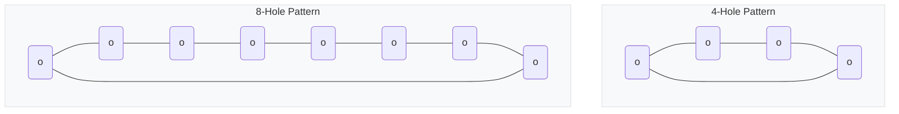

# PROJECT VULCAN - USEFUL REPOSITORIES & VISUAL STANDARDS

---

# CRITICAL RULE: ALWAYS SHOW VISUAL EXAMPLES

## WRONG:
"Consider using a hole table."

## RIGHT:
```
CURRENT:                    RECOMMENDED:
0"-+-3/16"-+-3/8"-+...      HOLE TABLE:
   |      |      |          ID | X   | Y   | DIA
   o      o      o          A1 |3/16"|1-5/8"|11/16"
(stacked dims)              A2 |3/8" |1-5/8"|11/16"
```

---

# USEFUL GITHUB REPOS

## Drawing OCR:
- **eDOCr**: github.com/javvi51/eDOCr - Engineering drawing OCR
- **Image2CAD**: github.com/adityaintwala/Image2CAD - Drawing to DXF
- **Text Detection**: github.com/2Obe/Text-Detection-on-Technical-Drawings

## Structural Engineering:
- **AISC Database**: github.com/buddyd16/Structural-Engineering
- **steelpy**: pypi.org/project/steelpy/
- **pyaisc**: github.com/mwhit74/pyaisc

## Hole Detection:
- **OpenCV HoughCircles**: Built-in circle detection

---

# MANDATORY CROSS-CHECK

EVERY PART must be checked against mating parts:

1. **HOLE ALIGNMENT**: +/-1/16" tolerance
2. **HOLE SIZE MATCH**: Same bolt = same hole
3. **PATTERN COUNT**: Same number of holes
4. **ASSEMBLY FIT**: No interferences

This is NOT optional - it's the CORE function!

---

# VISUAL TEMPLATES

## Edge Distance:

```mermaid
flowchart LR
    subgraph Problem["❌ PROBLEM"]
        P1["Hole<br/>0.5\" edge<br/>TOO CLOSE!"]
    end
    
    subgraph Correct["✅ CORRECT"]
        C1["Hole<br/>1.5\" edge<br/>ADEQUATE"]
    end
    
    Problem -.->|"Fix"| Correct
    
    style Problem fill:#ffcccc,stroke:#cc0000,stroke-width:2px
    style Correct fill:#ccffcc,stroke:#00cc00,stroke-width:2px
    style P1 fill:#ff6b6b,stroke:#c92a2a,stroke-width:2px,color:#000
    style C1 fill:#51cf66,stroke:#2f9e44,stroke-width:2px,color:#000
```

## Hole Alignment:

```mermaid
flowchart TB
    subgraph Mismatch["❌ MISMATCH"]
        MA["Part A: Hole at 6-1/4\""]
        MB["Part B: Hole at 6\""]
        MResult["FAIL!"]
    end
    
    subgraph Aligned["✅ ALIGNED"]
        AA["Part A: Hole at 6-1/4\""]
        AB["Part B: Hole at 6-1/4\""]
        AResult["OK!"]
    end
    
    MA --> MB --> MResult
    AA --> AB --> AResult
    
    style Mismatch fill:#ffcccc,stroke:#cc0000,stroke-width:2px
    ```

---

# WELD SYMBOL VISUAL GUIDE

```mermaid
flowchart LR
    Tail["🚩 Tail<br/>(Spec/Process)"]
    Reference["─── Reference Line ───"]
    Arrow["↘️ Arrow"]
    Below["⬇️ Arrow Side<br/>(Bottom)"]
    Above["⬆️ Other Side<br/>(Top)"]
    
    Tail --- Reference
    Reference --- Arrow
    Above --- Reference
    Reference --- Below
    
    style Reference stroke-width:4px
    style Arrow stroke-width:3px
    style Above fill:#e7f5ff,stroke:#228be6
    style Below fill:#fff4e6,stroke:#fd7e14
```

### Common Weld Symbols:
- **Fillet**: `▽` (Triangle)
- **V-Groove**: `∨` (V-shape)
- **Plug/Slot**: `▭` (Rectangle)
- **Flare-V**: `⟇` (Curved V)

---

# GD&T SYMBOL VISUAL REFERENCE

| Category | Symbol | Name | Description |
|----------|--------|------|-------------|
| **Form** | `─` | Straightness | Part must be straight within tolerance |
| | `⏥` | Flatness | Surface must be flat |
| | `○` | Circularity | Cross-section must be round |
| **Orientation** | `⟂` | Perpendicularity | 90° to datum |
| | `∠` | Angularity | Specific angle to datum |
| | `∥` | Parallelism | Parallel to datum |
| **Location** | `⌖` | Position | Center point location (CRITICAL) |
| | `◎` | Concentricity | Shared center with datum |
| | `⌯` | Symmetry | Equal distribution around datum |

---

# FLANGE BOLT PATTERNS (ACHE)



**Rule**: All flange holes MUST be straddled (holes offset 45° or 22.5° from centerlines).
- [ ] No holes on vertical/horizontal centerlines (unless specified)
- [ ] Straddle bolt holes for standard flange orientation
