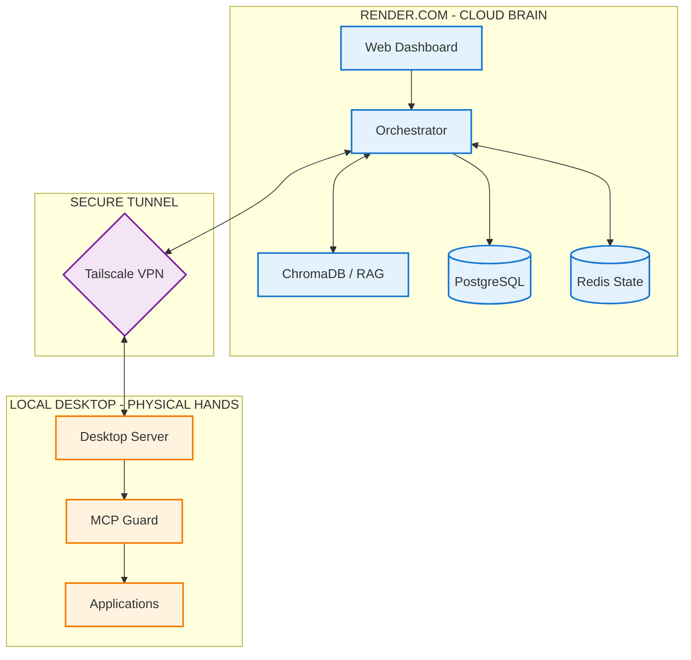

# System Architecture: Project Vulcan

This document provides a high-level overview of the Project Vulcan architecture, tracking the flow of data from the user's request to local hardware execution.

---

## 🏗️ The 4-Layer Architecture

Project Vulcan is built on a distributed "Bouncer-and-Brain" model, separating high-level reasoning from low-level execution.

1.  **UI Layer (Web)**: Next.js frontend providing the command interface and visualization dashboard.
2.  **Intelligence Layer (Cloud)**: The Orchestrator and specialized AI agent fleet.
3.  **Security Layer (VPN)**: Tailscale encrypted tunnel connecting Cloud to Local.
4.  **Execution Layer (Desktop)**: Local server translating AI intent into mouse/keyboard/app actions.

---

## 🔄 Core Data Flow

---

## 🔑 Key Components

### 1. 📂 Intelligence Layer (Cloud)

- **Orchestrator**: The central brain that receives user requests, maintains session state in **Redis**, and routes tasks to specialized agents.
- **Agent Fleet**: Specialized LLM-powered workers:
  - **CAD Agent**: Precision design via SolidWorks COM.
  - **Sketch Agent**: Computer Vision (OCR/Geometry) for Photo-to-CAD.
  - **Trading Agent**: Market analysis and automation via custom macros.
  - **Work Agent**: Task management and J2 Tracker integration.

### 2. 📦 Persistence & RAG

- **PostgreSQL**: Stores long-term data like completed trades, CAD validation history, and security logs.
- **ChromaDB**: Our Vector database for **Retrieval-Augmented Generation (RAG)**. It allows agents to "remember" thousands of engineering standards and technical docs.
- **Redis**: Handles high-speed temporary state and WebSocket communication.

### 3. 🔐 The Bridge (Tailscale VPN)

- **Zero-Trust Connectivity**: Tailscale creates a virtual private network between the Render server and your local PC.
- **Encrypted Path**: No public ports are opened. Render talks to your PC as if it were a local IP (`100.x.x.x`).

### 4. ⚡ Local Execution (The MCP Guard)

- **Translator**: The Desktop Server converts abstract AI commands into hardware-specific API calls (SolidWorks COM, Windows UI Automation).
- **Safety Layer**: Implements a dedicated **Kill Switch** and hardware-level circuit breakers to stop automation instantly if needed.

---

## 🔒 Security & Observability

- **Sentry Integration**: Real-time error tracking across both the Cloud API and the Local Desktop Server.
- **Proxy Pattern**: The Cloud never touches your files directly. It only sends requests to the local server, which acts as a "bouncer."
- **Audit Logging**: Every action taken by an agent is logged locally and to the PostgreSQL database for full traceability.
