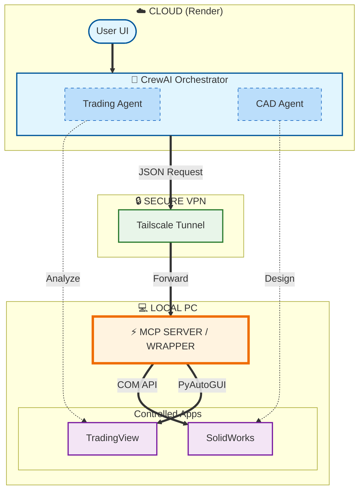

# System Architecture: The Universal Connector

This diagram visualizes the strictly hierarchical control flow: **Render -> Tailscale -> MCP Server -> Apps**.

### Key Components

1.  **Cloud (Render)**:
    *   Hosts the **Intelligence** (LLMs, Agents).
    *   Runs 24/7.
    *   No access to your physical devices *except* via the tunnel.

2.  **The Tunnel (Tailscale)**:
    *   Makes your local PC appear as if it's "on the same wifi" as the Cloud Server.
    *   Zero public ports opened on your router (Safe!).

3.  **Local Desktop Server (The MCP Endpoint)**:
    *   **The Guard**: Checks the Kill Switch and Circuit Breaker.
    *   **The Translator**: Converts "Make a Box" (AI Speak) into `SketchManager.CreateCornerRectangle(0,0,0, 10,10,0)` (CAD Speak).
    *   **The Queue**: Ensures your PC does one thing at a time.

### 🔒 Security Note: No Direct Connection
*   **SolidWorks & TradingView Stay Local**: They do **NOT** connect to Render or the Internet directly.
*   **The Proxy Pattern**: Render talks *only* to the Python Script (`server.py`). The Script then talks to the Apps.
*   **Why?**: This means hackers cannot touch your TradingView or CAD files. Use the server as a "bouncer."
